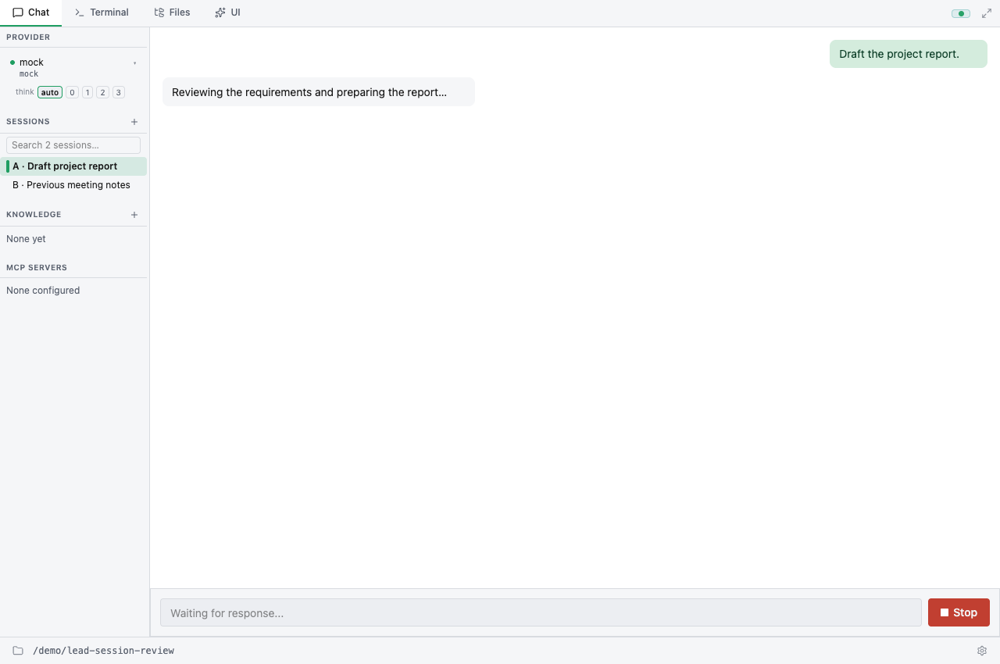
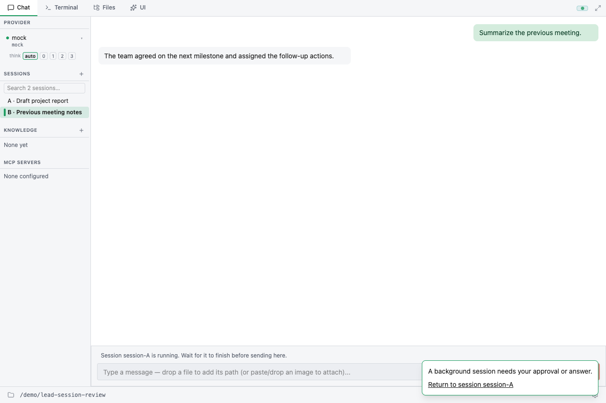

# Browse lead sessions while a turn runs

Selecting another saved session, or **New session**, changes the conversation
shown in Chat and Terminal without cancelling the lead's running turn. Return
to its session to see the accumulated output and control that turn.

There is still one lead executor. While session A runs, session B can be read,
but its composer is blocked. Wait for A to finish before sending a prompt in B.
Sending in an idle saved session activates that session and its provider/history
before executing the prompt. Existing command-line session switching remains
an execution operation.

Output, plan/goal snapshots, and turn usage remain associated with the execution
session. Approval and question UI retains the originating session. If that session
is in the background, a persistent notification offers a button to return to it.
Responding or completing the turn clears its pending notification. Reconnecting
restores the execution identity separately from the conversation being viewed.

New session is an unsaved preview. Its header is written only when the first
prompt is submitted; repeated New clicks do not fill the sidebar with empty files.

Attachments use the same validator for targeted input and the desktop fallback:
up to 10 images and 67 MiB of base64-encoded payload. Invalid or excess attachments
reject the entire submission with an error; no images are silently dropped. Both
routes accept `mediaType`/`data`, and neither resizes images. The existing frontend
10 MiB per-image check still runs before encoding.

This change does not add live teammate session viewing or team management.

## Verification

- `pnpm --dir frontend test`: navigation without cancellation, stale snapshots,
  event sequence boundaries, reconnect identity, input/Stop targets, questions,
  and suppression of another session's output.
- `cargo test --features gui --lib session_view`: presentation replay, plan
  preservation, event-time busy state, and IPC view/New requests that do not
  queue worker session switches or cancel the execution session.
- `cargo test --features gui --lib cancelled_gui_approval`: cancelled approval
  requests are removed before reconnect replay.
- `cargo test --features gui --lib ws_round_trip_processes_slash_command`:
  WebSocket event envelopes, reconnect identity, and an actual Close frame after `/quit`.

For manual verification, start a long-running turn in A, select saved session B,
then select New. Confirm A continues, input in the other view is blocked, and
returning to A restores its output. Repeat with an approval/question pending
and after reconnecting. Verify Stop in A interrupts only the intended turn.

## Browser fixture captures

These are the real React UI with a simulated IPC backend. They show the state
before and after switching in this implementation, not an upstream-versus-PR
comparison or proof of a live provider run. The browser check also injected an
A output event while viewing B and verified that it did not appear in B, and
checked that navigation sent no cancellation message.

Before switching: A is running.

After switching: B is visible and its composer explains that A is still running.

## Protocol and persistence limits

Chat/Terminal presentation events are carried inside `session_event` envelopes
with `session_id`, `sequence`, and `events`. A `session_view` snapshot carries the
matching request ID and replay boundary. Raw WebSocket consumers must unwrap the
new envelopes. GUI Shell events retain their separate bridge dispatch.

Live presentation replay retains at most 16 transcripts, each capped at 4,096
frames and 2 MiB of serialized frame data (32 MiB serialized payload total, plus
bounded container/render-state overhead). Oldest frames are removed first; a
single frame larger than the byte budget is omitted. Chat and Terminal show a
leading trimming notice. The currently executing transcript is never evicted;
other transcripts are evicted by least recent activation/view. Viewing an evicted
session reconstructs its bounded preview from its saved file.

These limits bound retained replay, not transient rendering allocations or total
process memory. Saved session files are untouched and retain the persisted
history; the bounded UI preview does not promise to display arbitrarily large
history in full. A backend restart relies on those files. This is not a new
persistent event store.

## Why controls keep their owner

Navigation sends a view request to the presentation stream; it does not enqueue
a worker session switch or cancellation. The worker remains the sole owner of
execution, and its activation events tag subsequent output with the session ID.
Snapshots and live frames share ordered sequence boundaries.

The frontend blocks controls while loading or viewing a different running
session. It tags Stop, approval responses, questions, and injected input with the
viewed session ID. IPC independently rejects a mismatched execution target;
approval/question handlers additionally check the pending request's recorded
session before resolving it. A cancelled approval is removed by its pending
guard, so reconnect cannot revive it. Tests exercise rejected Stop from B and
approved responses tagged A; browser fixture coverage returns from B via the
notification and verifies the transmitted approval owner. These checks use
controlled inputs, not a claim of a live-provider end-to-end run.

