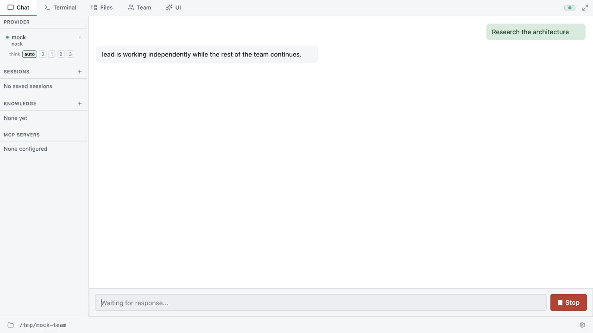

# Viewing concurrent agent sessions

A **session** stores a conversation and its plan, goal, and usage. An **agent**
executes turns. Agent Teams already run teammates in separate processes and
coordinate through inbox messages and the shared dependency task queue.

Enable Agent Teams in Settings, then ask the lead to create a team and assign
roles, for example:

> Create a researcher and a coder. Have researcher inspect the architecture and
> send findings to coder. Have coder implement the change after those findings.
> Use the shared task queue to track dependencies and report back to the lead.

In **Team**, choose **Open session** beside a teammate. Chat shows its live
conversation; Terminal shows the corresponding rendered output. Other agents
continue working while you switch views. The composer identifies the teammate
and sends text to its existing inbox, which it reads at the next turn. **Stop**
sends `AbortTurn` only to that teammate. The lead's running-session indicator
returns to the main session.

Ordinary saved sessions in the sidebar remain conversations for the single lead
executor. Browsing them, or clicking New, does not interrupt the lead. Sending a
new lead prompt waits until its current turn finishes. Use Agent Teams for
concurrent workers with distinct roles and coordination.

## Persistence and reconnection

Each GUI-enabled teammate binds its current session ID beside its existing
mailbox output log. An append-only event journal provides cursor-based replay
while the teammate streams. Completed/interrupted turns also save to the normal
session store, including plan, goal, and usage. Older session headers without an
agent owner remain readable. Replaced or stopped teammate sessions are read-only;
open the current session from Team to message a replacement.

The main executor keeps ordered presentation snapshots separately from the
selected view. Input and control messages carry a session ID; approval and
question requests retain their originating session. This does not introduce
another in-process scheduler or change Agent Teams' permission policy.

Teammate messages currently carry text, so share file paths instead of image
attachments. Headless teammates retain their existing approval behavior; the
session viewer does not add interactive permission prompts to those processes.
A build without the GUI feature still saves teammate history but does not write
the live GUI event journal.

## Local verification

- `pnpm -C frontend test`: navigation, stale snapshots, reconnection, ownership,
  teammate message/Stop routing, and cursor deduplication.
- `cargo test --features gui --lib session_view`: ordered replay, two real Agent
  loops using independently controlled mock provider streams, persistence,
  inbox isolation, cursor boundaries, and replaced-session rejection.
- `cargo test --features gui --lib team_control_assets_reach_the_selected_host_agent`: HTTP proxy routing with two simulated host agents, built-in Team Control assets, on-disk ownership, and explicit bot selection. This does not launch real agent processes.
- `cargo test --features gui --lib cancelled_gui_approval`: cancelled requests
  must not reappear on reconnect.
- For UI-only verification, run `pnpm -C frontend dev` and open
  `/tests/team-preview.html`. This fixture starts no backend or model. Open Team,
  select researcher, send a message, and click Stop. The browser console records
  the exact outbound IPC targets under `[team-fixture]`. It is a UI fixture, not
  a substitute for a live provider/process integration test.

## Manage team

The Team tab's **Manage team** panel edits the current bot's native team (one
team per bot). Create/edit its name and goal, then add teammates with a unique
name, role and initial instructions. **Save** only registers the member;
**Start** launches a real teammate using the existing SpawnTeammate path and
its configured model. New members share the bot's workspace.

**Stop turn** interrupts the current turn, leaving the teammate available.
**Request shutdown** asks it to exit; it can refuse while it has unfinished
work. Wait for its actual stopped status before editing or removing it.
**Remove member** removes membership only, preserving sessions, event journals,
logs and completed tasks. It rejects members that still own unfinished tasks.
Previously used session-bound names cannot be reused through this panel.
The lead belongs to the bot and cannot be removed here; manage bots in the
left rail. The management actions currently support single-user bot workspaces.

## Team Control GUI Shell

Choose **UI → Team Control** in the shell picker. The shell shows the current
bot's lead and configured teammates, including members not started yet. Create
or edit the team, add/edit members, and explicitly Start each worker. Select an
agent to send instructions, stop its current turn, request shutdown, or remove
its stopped membership. The existing backend still enforces unfinished-task
and history-preservation rules. This uses native Agent Teams, not parallel
`run()` calls through the GUI Shell's shared lead executor.

Activity displays recent worker logs plus lead progress. **Load history** reads
saved completed turns without activating that conversation; use Chat / Team's
Open session for live conversation replay. Changing the selected agent changes
only the view. Messages queue for the target's next turn; Stop targets only that
agent's current session. A stale card (removed member, restarted session, or
stopped worker) cannot send commands to a replacement. One team per bot and
single-user bot workspaces are currently supported.

The bridge exposes `thclaws.team.snapshot()`, `manage(operation)`,
`message(agent, sessionId, text)`, `stop(agent, sessionId)` and
`history(agent, sessionId)`. Permissions are respectively `team.read`,
`team.manage`, `team.message`, `team.control`, and `team.read`. Manage operations
use the same action payloads as the native Team tab. Replies carry the shell ID
to avoid resolving another shell's requests with an overlapping numeric ID.
The Team Control manifest deliberately does not request `agent.run`.
