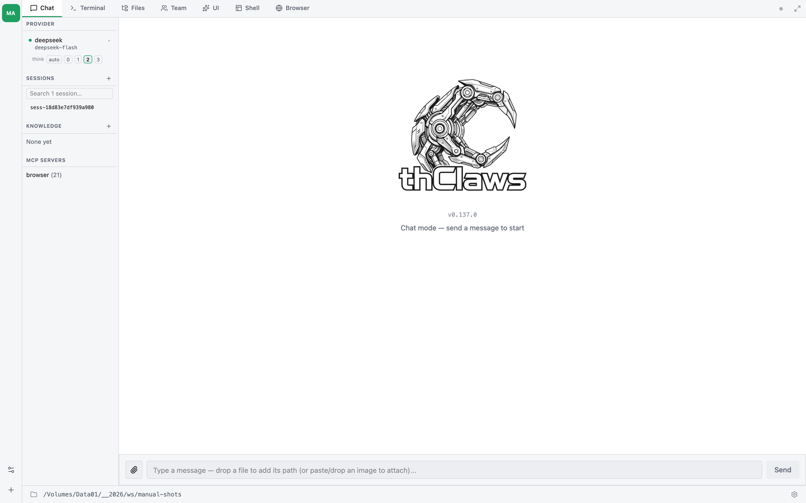
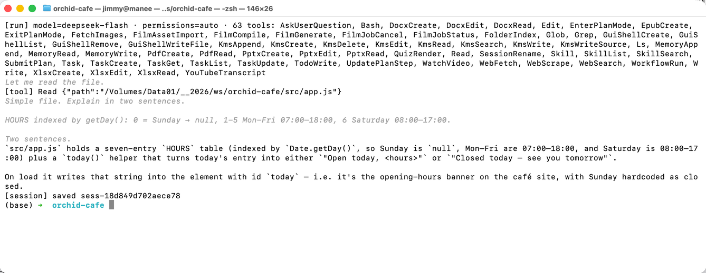

# บทที่ 3 — Working directory และโหมดการรัน

thClaws **ยึดตัวเองไว้กับ directory เดียว** tool ทุกตัวที่เกี่ยวกับไฟล์ —
read, write, edit, glob, grep, bash — จะถูกจำกัดให้อยู่ภายใน directory
นั้นและ descendant ของมันเท่านั้น เลือกให้ดี หากกว้างเกินไป (เช่น `/`)
จะเสียประโยชน์ของ sandbox ไป แต่ถ้าแคบเกินไป agent ก็จะมองไม่เห็นสิ่ง
ที่ต้องใช้

## ตั้งค่าครั้งแรกที่เปิดใช้ {#first-launch-setup}

การเปิด desktop GUI ครั้งแรกจะพาคุณผ่าน modal สองตัวตามลำดับ ก่อน
ปล่อยเข้าสู่หน้าต่างหลัก ส่วนการเปิดครั้งถัด ๆ ไป ระบบจะข้าม modal ตัว
ที่สองให้ เพราะได้จำตัวเลือก keychain / `.env` ของคุณไว้แล้ว

### 1. เลือก working directory

ทุกครั้งที่เปิด (ไม่ใช่แค่ครั้งแรก) จะมี modal ถามว่าอยากให้ thClaws
ยึดรากไว้ที่ไหน โดยช่องจะถูกกรอกล่วงหน้าด้วย `cwd` ปัจจุบัน พร้อม
แสดงสาม directory ล่าสุดที่คุณเคยเลือกไว้


เลือกได้สามวิธี:

1. **พิมพ์ path** ลงในช่องข้อความ
2. รายการทางลัด **Recent directories** (เก็บใน `~/.config/thclaws/recent_dirs.json`)
3. **Browse…** เปิดตัวเลือก folder แบบ native ของ OS (macOS ใช้ `osascript`, Linux ใช้ `zenity`, Windows ใช้ dialog ของ PowerShell)

เลือกอย่างใดอย่างหนึ่งแล้วคลิก **Start** แอปจะตั้งรากของ sandbox แล้ว
spawn PTY ของ REPL ให้

### 2. จะให้ thClaws เก็บ API key ไว้ที่ไหน?

**เฉพาะการเปิดใช้ครั้งแรกเท่านั้น** หลังจากเลือก working directory
เสร็จ จะมี dialog ที่สองขึ้นมาถามว่าอยากเก็บ API key ของ LLM ไว้ที่ไหน
dialog นี้จะรัน *ก่อน* ที่ thClaws จะไปแตะ keychain ของ OS —
ดังนั้นถ้าเลือก `.env` ก็จะไม่มี prompt ของ keychain เด้งขึ้นมาเลย


- **OS keychain (แนะนำ)** — เข้ารหัสและผูกกับ user account ของคุณ
  (macOS Keychain / Windows Credential Manager / Linux Secret
  Service) จะมี prompt ขอสิทธิ์จาก OS โผล่ขึ้นมาครั้งเดียวตอนที่
  thClaws อ่าน key เป็นครั้งแรก คลิก "Always Allow" แล้วการเปิดครั้ง
  ถัดไปจะไม่มีการถามอีก ยกเว้นเมื่อมีการอัพเดทเวอร์ชั่นของโปรแกรม
- **ไฟล์ `.env`** — เก็บ key เป็นข้อความธรรมดาไว้ที่
  `~/.config/thclaws/.env` ไม่มี prompt จาก keychain มารบกวน เหมาะกับ
  เครื่อง Linux แบบ headless ที่ไม่มี Secret Service แต่แลกมาด้วย
  ความเสี่ยงที่ใครก็ตามที่เข้าถึง home directory ของคุณได้
  จะอ่านไฟล์นี้ได้ด้วย

ตัวเลือกของคุณจะถูกบันทึกไว้ที่ `~/.config/thclaws/secrets.json` และ
มีผลถาวร หากเปลี่ยนใจภายหลังก็ทำได้ โดยไปที่ Settings → Provider API
keys → "Change…" ระบบจะเปิด chooser ตัวเดียวกันขึ้นมาอีก ดู
[บทที่ 6](ch06-providers-models-api-keys.md#secrets-backend-chooser)
สำหรับการเปรียบเทียบ trade-off แบบเจาะลึก

### CLI และ `-p` ข้าม modal ของ GUI

โหมด CLI และโหมดไม่โต้ตอบจะไม่แสดง modal — CLI ใช้ directory ที่คุณ
launch มันขึ้นมา ส่วนตัวเลือก backend ของ secret จะอ่านจาก
`~/.config/thclaws/secrets.json` (หรือใช้ค่าเริ่มต้นเป็น `.env` ถ้า
ไฟล์ไม่มีอยู่)

```bash
cd ~/projects/my-app
thclaws --cli
```

## โหมดการรัน

### Desktop GUI (ค่าเริ่มต้น)

```bash
thclaws
```

เปิด desktop app แบบ native ซึ่งมีสามแท็บ (Chat, Terminal, Files,
Team) พร้อม sidebar แสดงส่วน provider/sessions/knowledge/MCP และมี
ไอคอนเฟืองสำหรับ Settings ดู[บทที่ 4](ch04-desktop-gui-tour.md) สำหรับ
ทัวร์ฉบับเต็ม พร้อมภาพหน้าจอและคีย์ลัด

Terminal Tab:


Chat Tab:


### CLI แบบโต้ตอบ

```bash
thclaws --cli
```

agent ตัวเดียวกัน เพียงแต่อยู่ใน terminal ทุกฟีเจอร์ในคู่มือเล่มนี้
ใช้งานได้ที่นี่ — เพราะนี่คือกระดูกสันหลังที่ GUI ห่อหุ้มไว้นั่นเอง


ภายใน REPL บรรทัดที่คุณพิมพ์จะถูกแบ่งออกเป็นสามประเภท:

| Prefix | เกิดอะไรขึ้น |
|---|---|
| `/<name> [args]` | Slash command — มีในตัว หรือเป็น skill / legacy command (ดูบทที่ 10) |
| `! <shell cmd>` | Shell escape — รันใน terminal ของคุณโดยตรง ข้าม agent ทั้งหมด (ไม่เสีย token ไม่ต้อง approve) |
| *อย่างอื่น* | ส่งให้โมเดลในรูปของ user prompt |

Shell escape เหมาะมากสำหรับเช็คอะไรเร็ว ๆ ในระหว่างทำงาน:

```
❯ ! git status
On branch main
nothing to commit, working tree clean
❯ ! ls src
main.rs  lib.rs  config.rs
❯ now add a new module `auth.rs` based on config.rs
[tool: Read: src/config.rs] ✓
...
```

prefix เดียวกันนี้ใช้ได้ในแท็บ Terminal ของ desktop GUI ด้วย

### One-shot `-p` / `--print`

```bash
thclaws -p "What does src/main.rs do?"
thclaws --print "What does src/main.rs do?"    # equivalent long form
```

รันหนึ่ง turn สตรีมคำตอบออกมา แล้วออกจากโปรแกรม มีประโยชน์ใน CI,
git hook หรือ pipeline ของ shell:

```bash
git diff | thclaws -p "summarise this diff for a commit message"
```

ตั้งแต่ **v0.88.0** `-p` เป็น headless แบบ *เต็มความสามารถ* — เท่า CLI
แบบโต้ตอบ แค่ทีละหนึ่ง turn:

- **Session ถูกบันทึก** ลง store ของ workspace
  (`.thclaws/state/sessions/`) และ `--resume <id|last>` ต่อบทสนทนาเดิม
  พร้อม history ครบ:

  ```bash
  thclaws -p "จำไว้: โค้ดเนมของ release คือ Falcon"
  thclaws -p --resume last "โค้ดเนมของ release คืออะไร"   # → Falcon
  ```

  ใส่ `--no-session` ถ้าอยากได้พฤติกรรมเก่า (ไม่ทิ้งไฟล์) สำหรับ
  script แบบ one-shot
- **Subagent ใช้งานได้** — Task tool ถูก register แล้ว prompt ที่ต้อง
  fan-out (pipeline วิจัย, `WorkflowRun`, งานหลายบทบาท) ทำงานเหมือนบน
  GUI/CLI แทนที่ model จะ role-play ทุกบทบาทเองใน context เดียว
- **Hooks ทำงาน** — hooks ใน `settings.json` ชุดเดียวกับทุกโหมด
  (ดู[บทที่ 13](ch13-hooks.md))

บรรทัดสถานะ (`[session] saved …`, tool trace) ออกทาง **stderr** —
stdout ยังเป็นคำตอบสะอาดๆ pipe ได้เหมือนเดิม

chain ของ `--resume` นี้คือกลไกเบื้องหลัง **heartbeat schedule** —
งานประจำที่ต่อบทสนทนาเดียวโตขึ้นเรื่อยๆ แทนที่จะเริ่มจากศูนย์ทุกครั้ง
ดู[บทที่ 19](ch19-scheduling.md#heartbeats)



### `--serve` (HTTP/WebSocket server)

```bash
thclaws --serve                       # listen on 127.0.0.1:8443
thclaws --serve --port 7878           # custom port
thclaws --serve --bind 0.0.0.0        # bind all interfaces (auth required)
thclaws --serve --gui                 # plus open desktop window on same engine
```


engine ตัวเดียวกันถูก expose ผ่าน HTTP + WebSocket — เปิดได้สอง use case:

- **Webapp surface** — เปิดเบราว์เซอร์ไปที่ `http://127.0.0.1:8443/`
  จะได้ React frontend ตัวเดียวกับ GUI หน้าเดียวกัน เหมาะกับ
  remote access ผ่าน SSH tunnel หรือ Cloudflare Tunnel (ไม่ต้อง
  เปิด port ออกสาธารณะ)
- **AI Agent (API Server) surface** — `--serve` มาพร้อม
  `/v1/chat/completions` (OpenAI-compatible — ให้ Cursor, Aider,
  n8n, openai-python เรียกใช้ได้เลย), `/v1/messages`
  (Anthropic-compatible — ส่ง token มาทาง `x-api-key` หรือ Bearer
  ก็ได้) และ `/agent/run` + `/v1/agent/info` (thClaws-native สำหรับ
  orchestrator) — agent ตัวเดียวให้บริการได้ทั้งคน
  และซอฟต์แวร์พร้อมกัน

ค่าเริ่มต้น bind ที่ `127.0.0.1` เท่านั้น (single-user, localhost
loopback) ถ้าจะเปิดกว้างใช้ `--bind 0.0.0.0` แล้ว set
`THCLAWS_API_TOKEN` ในสิ่งแวดล้อม — request ทุก request ต้องมี
header `Authorization: Bearer <token>` ไม่งั้น 401

`--serve` กับ `--cli` / `--print` ใช้ร่วมกันไม่ได้ (mutually
exclusive) แต่ใช้ร่วมกับ `--gui` ได้ — desktop window กับ
browser tab จะ attach session เดียวกัน ดู[บทที่ 21](ch21-line-and-browser-chat.md)
สำหรับ LINE / browser bridge ที่ build บน `--serve`

### Flag ที่ใช้บ่อย

```
    --cli                    run the CLI REPL instead of the GUI
-p, --print                  non-interactive: run prompt and exit (implies --cli)
    --serve                  expose engine over HTTP/WebSocket (default bind 127.0.0.1:8443)
    --port N                 port for --serve mode (default 8443)
    --bind ADDR              bind address for --serve (default 127.0.0.1; 0.0.0.0 needs auth)
    --gui                    open desktop window (compose with --serve to attach to same engine)
-m, --model MODEL            override the model (e.g. claude-sonnet-4-6, moonshot/kimi-k2.6)
    --accept-all             auto-approve every tool call (dangerous — see ch5)
    --permission-mode MODE   auto | ask
    --max-iterations N       max agent loop iterations per turn (0 = unlimited, default 200)
    --resume ID              resume a saved session ("last" for most recent)
    --system-prompt TEXT     override the system prompt entirely
    --allowed-tools LIST     comma-separated tool allowlist
    --disallowed-tools LIST  comma-separated tool denylist
    --verbose                extra diagnostic output
```

## Session

ทุก turn จะถูกบันทึกอัตโนมัติลงไฟล์ `./.thclaws/state/sessions/<id>.jsonl`
Session จะ **ผูกกับโปรเจกต์** — เมื่อคุณเริ่ม thClaws ใน directory ใหม่
ก็จะเจอรายการ session ที่ยังว่างเปล่า

ดู[บทที่ 7](ch07-sessions.md) สำหรับคำสั่งครบชุด (`/save`, `/load`,
`/rename`, `/sessions`, `--resume`) รูปแบบการเก็บไฟล์บน disk และวิธีที่
session โต้ตอบกับการเปลี่ยน provider / model

## ใน `.thclaws/` มีอะไรบ้าง

ตั้งแต่ **workspace v2** โฟลเดอร์นี้แบ่งเป็นสองชั้น และควรรู้ไว้ เพราะมันคือ
ตัวตัดสินว่าอะไรติดไปกับ agent และอะไรอยู่กับเครื่อง

**ชั้น config — ตัว agent เอง** deploy ได้ publish ได้ ควร commit:

```
.thclaws/
├── settings.json      config ระดับโปรเจกต์ (model, permission, รายการ tool, kms.active)
├── mcp.json           MCP server ของโปรเจกต์
├── AGENTS.md          คำสั่งระดับโปรเจกต์
├── agents/            นิยาม agent (*.md)
├── skills/            skill ที่ติดตั้งไว้
├── commands/          slash command แบบ prompt template (ของเดิม)
├── plugins/           plugin bundle ที่ติดตั้ง
├── plugins.json       ทะเบียน plugin (ระดับโปรเจกต์)
├── prompt/            prompt ที่ override ไว้
├── rules/             ไฟล์ *.md เพิ่มเติมที่ฉีดเข้า system prompt
├── data/              ไฟล์ที่ติดไปกับ agent
├── agent_workflow/    สคริปต์ workflow ที่เขียนไว้ (*.js) — ดูบทที่ 25
└── memory/            MEMORY.md และไฟล์ memory รายหัวข้อ — ดูบทที่ 8
```

**ชั้น state — runtime ของเครื่องนี้** อยู่ใน gitignore ไม่เคยถูก publish
และรอดข้ามการอัปเดต agent:

```
.thclaws/state/
├── sessions/          ประวัติ session — ดูบทที่ 7
├── kms/               ฐานความรู้ระดับโปรเจกต์ — ดูบทที่ 9
├── team/              runtime state ของ Agent Teams — ดูบทที่ 17
├── workflows/         state ของ workflow ที่รันไป — ดูบทที่ 25
├── schedule/          state ของงานตั้งเวลา — ดูบทที่ 19
├── todos.md           กระดาษทดของ agent
├── usage/  usage.jsonl  บัญชี token
├── media-jobs.jsonl   งานวิดีโอที่ยังทำอยู่ — ดูบทที่ 11
├── phone-home.json    binding ของ thClaws Remote
├── cache/             cache ต่างๆ
└── browser-profile/   โปรไฟล์ Chromium ที่ engine ดูแล — ดูบทที่ 28
```

> **อัปเกรดมาจากเวอร์ชันเก่า?** ไม่ต้องทำอะไร ครั้งแรกที่ thClaws เปิด
> workspace แบบก่อน v2 มันจะย้ายรายการเหล่านี้ลง `state/` ให้เอง เป็นการ
> *ย้าย* ไม่ใช่คัดลอก จึงไม่มีอะไรหาย ส่วน `memory/` จงใจให้อยู่ชั้นบน
> เพราะเป็นส่วนหนึ่งของตัว agent ไม่ใช่ state ของเครื่อง

การ publish agent (`/cloud publish`) หรือ deploy (`/deploy`) จะพาเฉพาะชั้น
config ไป และข้าม `state/` ทั้งก้อน นั่นคือเหตุผลที่ agent ที่เผยแพร่ออกไป
ไม่เคยมี session, ฐานความรู้ หรือ cookie ของคุณติดไปด้วย

