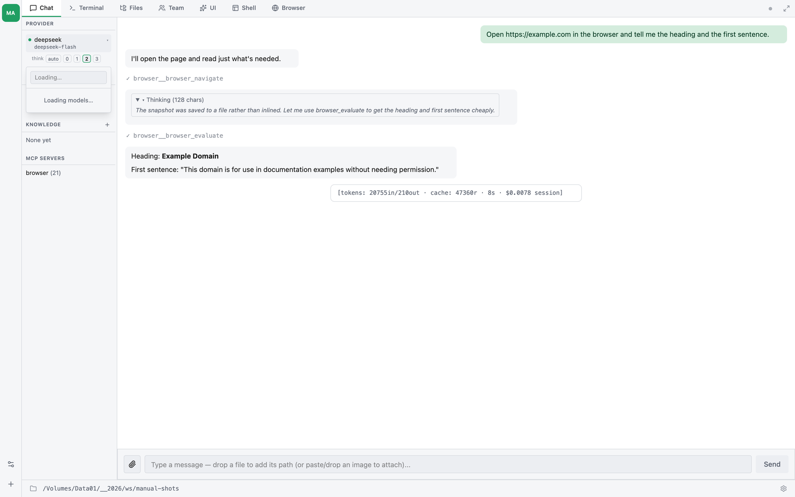
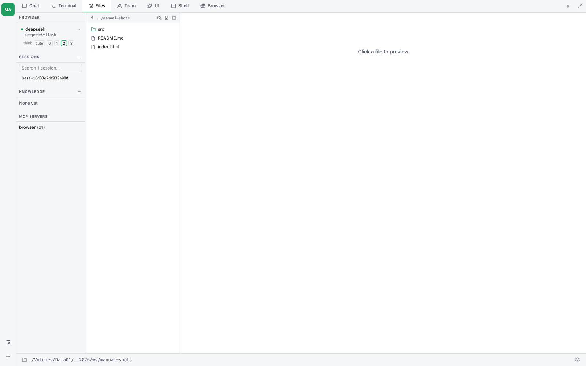
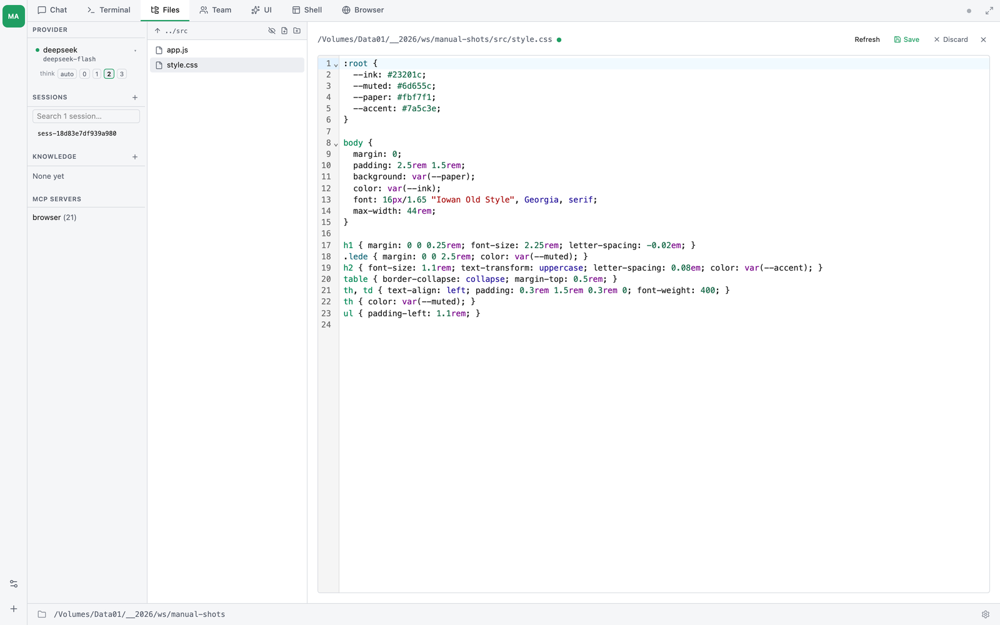
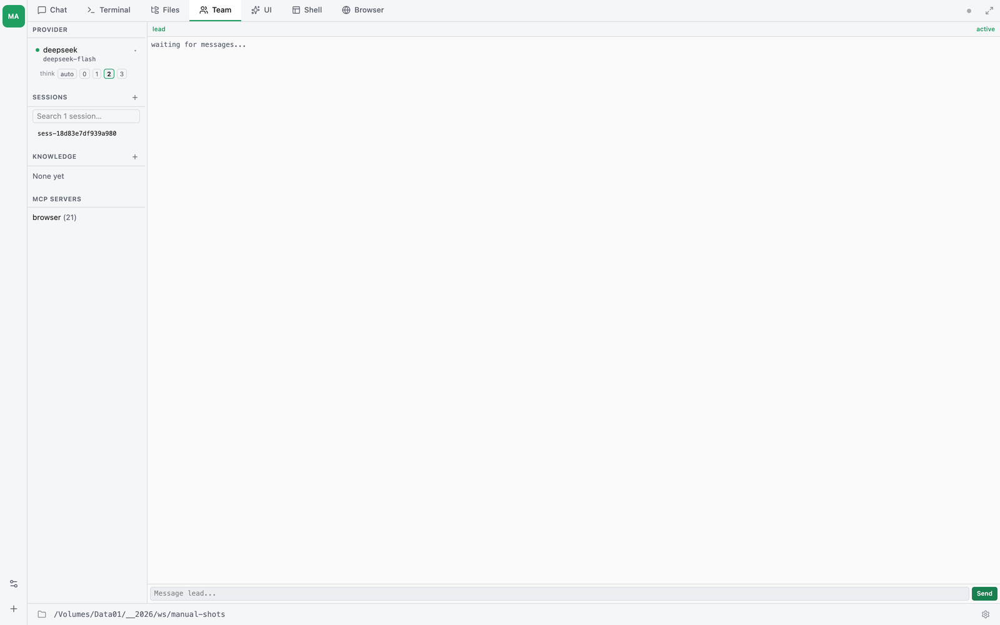
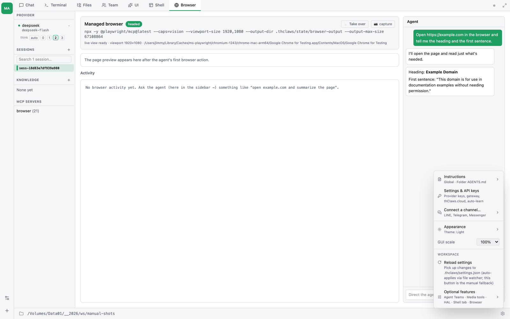
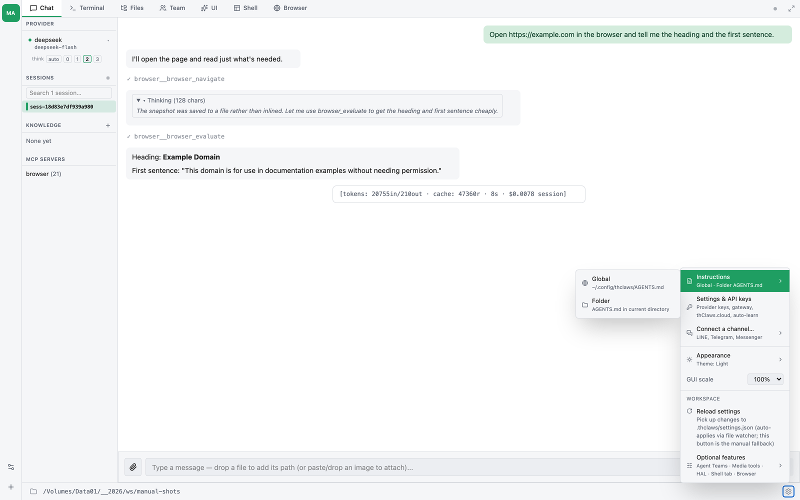
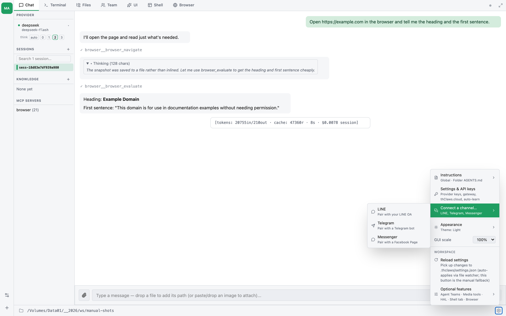
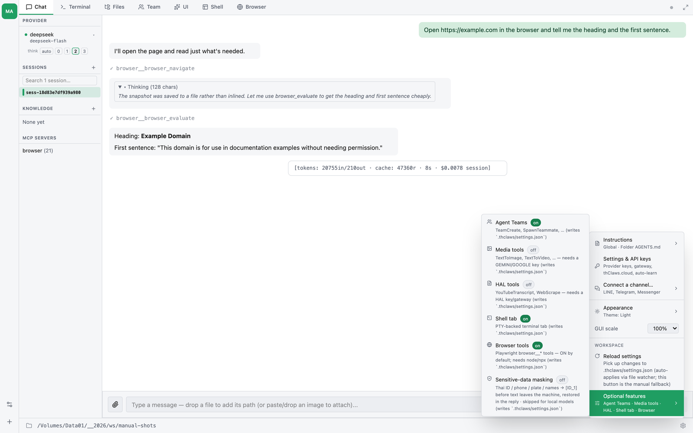
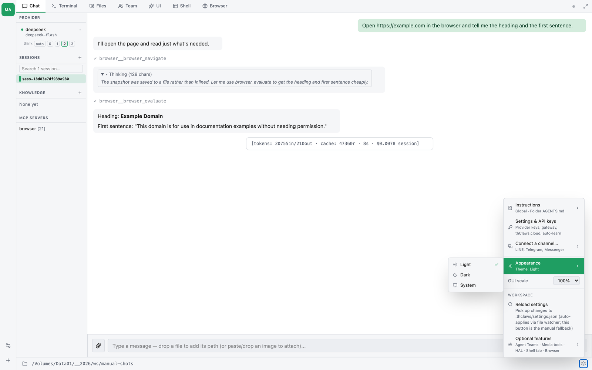
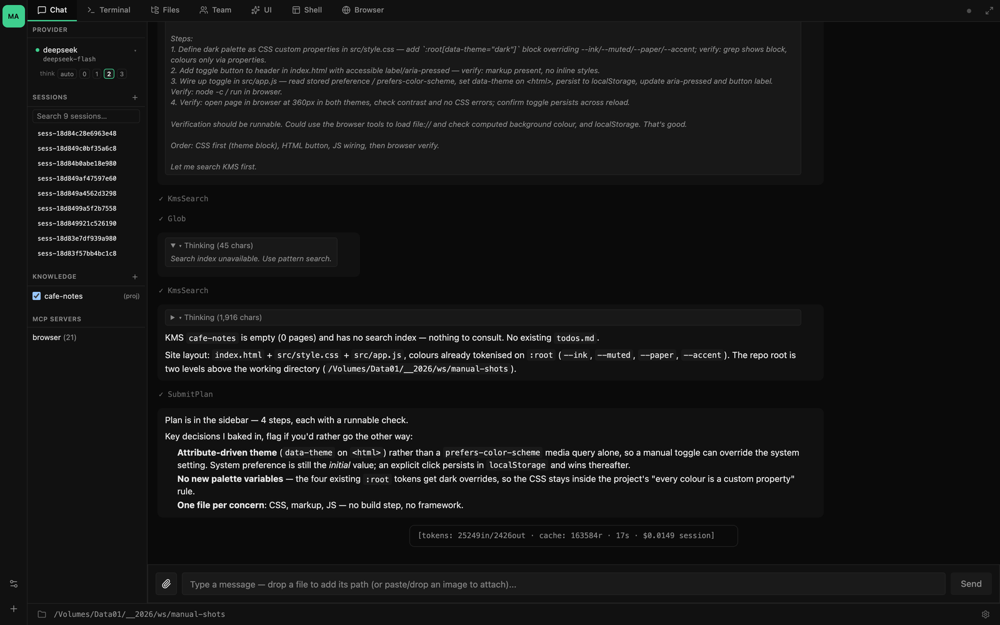

# บทที่ 4 — ทัวร์ Desktop GUI

การรัน `thclaws` โดยไม่ใส่อาร์กิวเมนต์ใด ๆ จะเปิดแอป desktop แบบ native ซึ่งเป็น webview ที่หุ้ม React frontend ไว้ และเชื่อมต่อกับ Rust agent core ตัวเดียวกับที่ CLI ใช้ บทนี้คือทัวร์นำชมหน้าต่างหลัก — อ่านสักครั้งเพื่อให้จำทุกส่วนของ UI ได้ตอนต้องใช้งานจริง

ถ้าใช้แต่ REPL ในเทอร์มินัล จะอ่านบทนี้ผ่าน ๆ แล้วข้ามไปก็ได้ ทุกอย่างที่ GUI ทำได้ ก็ใช้ผ่าน terminal ได้เช่นกัน

> **การตั้งค่าเมื่อเปิดใช้งานครั้งแรก** — ตอนเปิด thClaws ครั้งแรก จะมี modal สองตัวขึ้นเรียงกัน (เลือก working directory ก่อน แล้วค่อยเลือกที่เก็บ API key) ทั้งคู่อธิบายไว้ใน[บทที่ 3](ch03-working-directory-and-modes.md#first-launch-setup) แล้ว บทนี้จึงถือว่าคุณผ่านขั้นตอนนั้นมาแล้ว

## หน้าต่างหลัก — เลย์เอาต์

- **แถบ agent** (ซ้ายสุด แคบ ๆ) — หนึ่งช่องต่อหนึ่ง agent ใน workspace นี้ ปิดท้ายด้วยปุ่มตั้งค่า workspace และปุ่มเพิ่ม agent — workspace หนึ่งเก็บ agent ได้ถึง 8 ตัว ดู[บทที่ 35](ch35-agents-in-a-workspace.md) ถ้ามี agent ตัวเดียวมันจะเหลือแค่ช่องเดียว จึงมองข้ามได้ง่าย
- **แถบแท็บ** (ด้านบน) — Chat, Terminal, Files และแท็บเสริมเท่าที่เปิดไว้
- **Sidebar** (คอลัมน์ซ้าย) — สี่หมวด ครอบคลุม provider + model ที่ใช้งานอยู่, session ที่บันทึกไว้, knowledge base ที่แนบไว้ และ MCP server ที่ตั้งค่าไว้
- **เนื้อหาของแท็บที่ใช้งาน** (ขวา) — เปลี่ยนไปตามแท็บที่คุณอยู่: chat แบบ streaming, เทอร์มินัลแบบ live, ตัวเปิดไฟล์ หรือหน้า team
- **แถบสถานะ** (ด้านล่าง) — working directory ปัจจุบันอยู่ทางซ้าย ส่วนไอคอนเฟืองสำหรับ Settings อยู่ทางขวา

### Sidebar (คอลัมน์ซ้าย)

Sidebar แสดงอยู่ตลอดเวลา และประกอบด้วยสี่หมวด:

| หมวด | แสดง | การกระทำ |
|---|---|---|
| **Provider** | provider + model ที่ใช้อยู่ จุดบอกสถานะ เครื่องหมาย ▾ และแถว `think` | คลิกที่บรรทัด model เพื่อเปิด inline model picker (v0.7.2+) |
| **Sessions** | ช่องค้นหา แล้วตามด้วย session ที่บันทึกไว้ (ชื่อหรือ ID) | `+` เพื่อเริ่ม session ใหม่ · พิมพ์เพื่อกรอง · วางเมาส์เหนือรายการ → ไอคอนดินสอเพื่อเปลี่ยนชื่อ · คลิกเพื่อโหลด |
| **Knowledge** | KMS ทั้งหมดที่ค้นหาได้ พร้อม checkbox เพื่อแนบ | `+` เพื่อสร้าง KMS ใหม่ — ดู[บทที่ 9](ch09-knowledge-bases-kms.md) |
| **MCP Servers** | MCP server ที่ใช้อยู่ พร้อมจำนวน tool | อ่านอย่างเดียวตรงนี้ — ตั้งค่าผ่าน `/mcp add` |

หมวด **Provider** มีตัวแสดงสถานะแบบมองเห็นได้:

- 🟢 จุดเขียว + ข้อความปกติ: provider พร้อมใช้งาน
- 🔴 จุดแดง + ~~ขีดฆ่า~~ + "no API key — set one in Settings": provider ยังไม่มี credential

เมื่อบันทึก key ผ่าน Settings จุดจะเปลี่ยนเป็นสีเขียว และ model ที่ใช้งานอยู่อาจสลับไปยัง provider ตัวแรกที่มี credential ให้โดยอัตโนมัติ — ดู[บทที่ 6](ch06-providers-models-api-keys.md#auto-switch-on-key-save)

**งบการคิด (thinking budget)** — ใต้บรรทัด model มีแถว `think`: `auto · 0 · 1 · 2 · 3` ใช้กำหนดว่าจะให้โมเดลใช้การให้เหตุผลมากแค่ไหนในเทิร์นถัดไป โดยไม่ต้องพิมพ์ slash command `auto` ปล่อยให้ engine ตัดสินจากตัว prompt เอง `0` ปิด extended thinking ส่วน `1`–`3` ขอ budget ที่ใหญ่ขึ้นตามลำดับ โมเดลที่ไม่มีโหมดให้เหตุผลจะไม่สนใจค่านี้ ตัวคุมเดียวกันนี้คือ `/thinking` เมื่ออยู่ใน REPL — ดู[บทที่ 10](ch10-slash-commands.md)

**Inline model picker** (v0.7.2+): คลิกที่แถว Provider เพื่อเปิด dropdown แบบ search-as-you-type แสดง model ทุกตัวที่ catalogue รู้จัก จัดกลุ่มตาม provider พร้อม model จาก local Ollama ที่ค้นพบ live ผ่าน `/api/tags` ด้วย คลิกแถวเพื่อสลับ — การเปลี่ยนแปลงจะ persist ลง `.thclaws/settings.json` และ provider ที่ใช้งานอยู่จะถูก rebuild ใน place (ใช้ path เดียวกับ `/model`) กด Esc หรือคลิกนอก dropdown เพื่อยกเลิกโดยไม่เปลี่ยนค่า

### แถบ agent (ซ้ายสุด)

แถบแคบ ๆ ที่ขอบซ้ายคือรายชื่อ agent ของ workspace — หนึ่งช่องต่อหนึ่งตัว
แสดงอักษรย่อ และตัวที่ใช้อยู่จะถูกไฮไลต์ เอาเมาส์ชี้ค้างจะเห็นชื่อกับสถานะ
(`main — ready`)

ท้ายแถบมีปุ่มสองปุ่ม:

| ปุ่ม | ทำอะไร |
|---|---|
| **Workspace settings** | เพิ่ม ลบ หรือรีสตาร์ท agent ใน workspace นี้ |
| **Add an agent** | ดึง agent จาก Agent Template หรือสร้างตัวเปล่า |

agent แต่ละตัวเก็บบทสนทนา เซสชัน และการตั้งค่าของตัวเอง แต่ทุกตัวอ่านและเขียน
ไฟล์โปรเจกต์*ชุดเดียวกัน* — working directory ที่แสดงในแถบสถานะใช้ร่วมกัน
ดู[บทที่ 35](ch35-agents-in-a-workspace.md)

### Sidebar ขวา (context-sensitive)

ด้านขวาของหน้าต่างมี sidebar เสริมที่จะปรากฏก็ต่อเมื่อ feature ที่เกี่ยวข้องกำลังทำงานอยู่ ทุกตัวเป็นคอลัมน์กว้าง 260 px มี chevron tab สำหรับยุบ/ขยาย และปุ่ม `X` สำหรับซ่อน

| Sidebar | Trigger | จุดประสงค์ |
|---|---|---|
| **Goal** | `/goal start` ทำงาน | แสดง goal + iteration budget + token usage — ดู[บทที่ 19](ch19-scheduling.md) |
| **Todo** | มีการเรียก `TodoWrite` | Checklist live จาก `.thclaws/state/todos.md` — ดู[บทที่ 18](ch18-plan-mode.md) |
| **Plan** | Plan mode ทำงาน | Plan แบบ step-by-step + ปุ่ม approve / cancel / skip |
| **Research** | `/research` กำลังรันหรือเพิ่งจบ | Progress ของ iteration, score history, phase log — ดู[บทที่ 20](ch20-research.md) |
| **Background agents** | `/dream` / `/agent` / `/translator` ทำงาน | Elapsed time + last tool call ของ side-channel agent ทุกตัว, auto-prune entry ที่จบหลัง 5 นาที — รายละเอียดด้านล่าง |
| **KMS browser** | คลิกชื่อ KMS ใน sidebar ซ้าย | List pages + sources; คลิก entry เพื่อเปิดในหน้า viewer |

ถ้ามีหลายตัวเปิดพร้อมกัน จะเรียงจากซ้ายไปขวา: Goal → Todo → Plan → Research → Background agents → KMS browser

**Background agents sidebar** — bubble ที่ inline chat ของ `/dream` (หรือ side-channel ตัวอื่น) มักจะ scroll หายไประหว่าง run นานๆ; sidebar นี้คือคำตอบของ "ยังรันอยู่มั้ย" แบบ persistent แต่ละ entry ที่กำลังรันจะแสดง ◉ + ชื่อ agent + เวลาที่ผ่าน (tick ทุก 1 วินาที); เมื่อจบจะเปลี่ยนเป็น ✓ + duration รวม + (สำหรับ `/dream`) hint `→ dream-YYYY-MM-DD` ชี้ไปที่หน้า summary. Error แสดง ✗ + บรรทัดแรกของ error. Entry ที่จบ/error อยู่ค้าง 5 นาทีให้อ่านผลลัพธ์

ตอนปิด panel แต่ยังมี agent รันอยู่ chevron tab ที่ถูกยุบจะ glow สีเน้นเตือนว่ามีงานอยู่ คลิก chevron เพื่อเปิดกลับ

**KMS browser sidebar** — เปิดเมื่อคลิกชื่อ KMS ใน sidebar ซ้าย ไฟล์ที่กำลังเปิดอยู่ใน viewer overlay จะถูก highlight ด้วย accent-color left border + พื้นหลังเข้ม + ตัวหนา ทำให้เห็นได้ทันทีว่า entry ไหนตรงกับสิ่งที่กำลังแสดงบนจอ Highlight จะ scope เฉพาะ KMS ที่กำลัง browse อยู่ — เปิดไฟล์จาก KMS-A ขณะที่ browser ของ KMS-B เปิดอยู่ จะไม่ light up entry ที่ชื่อเดียวกันใน KMS-B

### แถบแท็บ

มีแท็บได้สูงสุดเจ็ดแท็บ พร้อมไอคอนเฟืองสำหรับ settings อยู่ทางขวา สี่แท็บแรก
มีเสมอ ส่วนอีกสามแท็บจะโผล่ก็ต่อเมื่อเปิดฟีเจอร์ที่อยู่เบื้องหลังมันแล้ว
การติดตั้งใหม่จึงเห็นแค่ **Chat · Terminal · Files**

Chat อยู่ซ้ายสุดและเป็นแท็บที่เปิดขึ้นมาเมื่อเปิดหน้าต่างใหม่

#### 1. แท็บ Chat

แผง chat แบบ streaming ที่ใช้ประวัติร่วมกับแท็บ Terminal (agent เดียวกัน session เดียวกัน) ข้อความจะ render เป็น Markdown ส่วนการเรียก tool จะแสดงเป็นบล็อก `[tool: Name]` ที่ยุบ/ขยายได้ และการใช้ token จะแสดงต่อท้ายข้อความตอบของ assistant ในแต่ละรอบ

ใช้แท็บ Chat เมื่อคุณชอบ UI แบบสนทนา ส่วนแท็บ Terminal ใช้เมื่อต้องการเห็น output ดิบ ๆ และรัน slash command

#### 2. แท็บ Terminal

เทอร์มินัล xterm.js ที่ฝังอยู่ภายใน รัน `thclaws --cli` (REPL ตัวเดียวกับที่ได้จาก CLI) การกดคีย์จะส่งผ่าน PTY bridge ไปยัง child process ส่วน output ก็ไหลกลับมาผ่าน frame ที่เข้ารหัสด้วย base64

พฤติกรรมสำคัญที่ควรรู้:

- **คัดลอก / วาง** — Cmd+C / Cmd+V (macOS) หรือ Ctrl+Shift+C / Ctrl+Shift+V (Linux/Windows) ทั้งหมดนี้ทำงานผ่าน native `arboard` IPC bridge เพราะ wry บล็อก `navigator.clipboard`
- **Ctrl+C** ทำงานตามบริบท: ถ้าบรรทัดที่พิมพ์อยู่ยังไม่ว่าง จะล้างบรรทัดนั้น (เหมือน `Ctrl+U` ใน bash) แต่ถ้าบรรทัดว่างอยู่แล้ว จะส่งต่อเป็น SIGINT
- **Resize** — ขนาดเทอร์มินัลจะเปลี่ยนตามหน้าต่าง ส่งต่อผ่าน `portable-pty` resize
- **Ctrl+L** ล้างหน้าจอ

#### 3. แท็บ Files

ตัวเปิดไฟล์ที่มี root เป็น working directory คลิกไฟล์ในทรีเพื่อเปิดดูในแพเนลด้านขวา และคลิกไอคอนดินสอข้าง path เพื่อสลับเข้าสู่โหมดแก้ไข

**โหมด Preview** (ค่าเริ่มต้น):

- ไฟล์ `.md` — เรนเดอร์เป็น HTML ที่ฝั่งเซิร์ฟเวอร์ (รองรับ GFM ทั้งตาราง task list ขีดฆ่า autolink และ footnote) แสดงใน iframe ที่มี sandbox โดย HTML ดิบที่ฝังอยู่ใน markdown จะถูกตัดออกก่อนเรนเดอร์
- ไฟล์ `.html` — เรนเดอร์ใน iframe sandbox ตัวเดียวกัน
- ไฟล์โค้ด (`.js`, `.ts`, `.tsx`, `.py`, `.rs`, `.go`, `.java`, `.cpp`, `.php`, `.json`, `.yaml`, `.sql`, `.xml`, `.css` และอื่น ๆ) — ไฮไลต์ syntax ด้วย CodeMirror 6 ในโหมดอ่านอย่างเดียว พร้อมเลขบรรทัด bracket matching และ search panel
- รูปภาพและ PDF — preview แบบ inline
- ไฟล์ข้อความ/คอนฟิก (`.txt`, `.log`, `.env`, `.conf`, `.ini`, `.toml`, `.sh`, `Dockerfile`, …) — แสดงใน `<pre>` ธรรมดา

**คลิกขวาที่ไฟล์ `.md`** จะได้คำสั่ง KMS สองแบบ ทั้งคู่ archive ไฟล์ต้นฉบับ
เป็น `sources/<alias>.md` ก่อนเหมือนกัน ต่างกันที่ page ที่ได้:

- **Add to KMS** — agent หลักเรียบเรียง stub page เป็นสรุปหนึ่งหน้า (เห็นเป็น turn ในแชท)
- **Add to KMS as atomic notes** — research job (ดูความคืบหน้าใน Research sidebar)
  digest ทั้งเอกสารทีละ window ~10k ตัวอักษร สกัด claim ที่ตรวจ quote แล้วและ entity
  จากนั้นเขียนหน้า topic ทับ `pages/<alias>.md` บวก **หนึ่ง note ต่อหนึ่งความคิด**
  ที่ link จากหน้า topic — ผลลัพธ์แบบ zettelkasten เดียวกับ `/research` อ้างอิงไปที่
  `../sources/<alias>.md` เลือกแบบนี้กับเอกสารยาวที่อยากไล่ดูตาม concept
  ส่วนสรุปธรรมดาเหมาะกับ note สั้น ๆ

ไฟล์ซอร์สจะเปิดใน CodeMirror แบบอ่านอย่างเดียว พร้อมเลขบรรทัดและการไฮไลต์
syntax ส่วนปุ่ม **Edit** มุมขวาบนใช้สลับเข้าสู่โหมดแก้ไข:

ไฟล์ `.html` จะถูกเรนเดอร์สดใน sandboxed iframe จึงเห็นหน้าเว็บได้เหมือนที่ browser แสดง — style, รูป และ JS แบบ interactive ทำงานได้ครบ

**โหมด Edit** (ไอคอนดินสอ):

- Markdown เปิดในเอดิเตอร์ **TipTap WYSIWYG** — ตัวเดียวกับที่ใช้กับ `AGENTS.md` ในเมนู Settings และรองรับ round-trip markdown
- ไฟล์โค้ดเปิดใน **CodeMirror 6** พร้อมไฮไลต์ syntax ตามภาษา bracket matching undo history และ search panel โดยภาษาจะเลือกให้จากนามสกุลไฟล์
- จุดทึบ (●) ข้างชื่อไฟล์หมายถึงมีการแก้ไขที่ยังไม่บันทึก ปุ่ม Save จะ disable ไว้จนกว่า buffer จะ dirty
- **Cmd/Ctrl+S** เพื่อบันทึก — มี toast สีเขียว "saved" หรือสีแดง "save failed: …" ขึ้นมายืนยัน
- ปุ่ม **Discard** (เมื่อ dirty) / **Preview** (เมื่อ clean) ใช้ออกจากโหมดแก้ไข การคลิก Discard จะเปิด native OS confirm dialog ("Discard / Keep editing") ขึ้นมาก่อนทิ้งการแก้ไข
- ถ้าคลิกไฟล์อื่นใน sidebar ขณะยัง dirty อยู่ ก็จะเจอ native confirm ตัวเดียวกัน — ต้อง save หรือ discard ก่อนจึงจะย้ายไฟล์ได้
- การ auto-refresh จะหยุด polling ระหว่างที่คุณแก้ไข เพื่อกันไม่ให้ tool call `Write`/`Edit` ของ agent มาทับ buffer ที่กำลังแก้อยู่

การเขียนไฟล์ทำผ่าน sandbox ของ working directory เดียวกับที่ agent ใช้ การแก้จึงอยู่ภายใน project tree เสมอ การ save ที่ผู้ใช้สั่งเองจะ **ไม่** ผ่าน approval prompt ของ agent — เพราะปุ่ม Save ถือเป็นการอนุมัติของคุณอยู่แล้ว

**ปุ่ม Refresh** — อ่านไฟล์ใหม่จากดิสก์และ remount iframe ของ preview ใช้หลังจาก agent แก้ไฟล์เบื้องหลัง (เช่น `dashboard.html` ของ productivity plugin ที่ regenerate task snapshot ของมันเอง) บังคับให้ iframe re-render แทนที่จะใช้ cache ของ browser มี prompt ก่อนทิ้งการแก้ที่ยังไม่ได้ save

**Dashboard host bridge** — HTML dashboard ที่เปิดในแท็บนี้สามารถอ่าน/เขียนไฟล์พี่น้องผ่าน `postMessage` ไปยัง React shell ได้เลย ไม่ต้องใช้ File System Access API picker dashboard ของ productivity plugin ใช้กลไกนี้: เมื่อ Refresh มันอ่าน `TASKS.md` สดผ่าน bridge (ไม่มี snapshot-staleness อีกต่อไป) ส่วน Save เขียนกลับลงดิสก์ผ่าน `file_write` IPC ของ thClaws HTML page ใด ๆ ที่ post `{type: "thclaws-dashboard-load" | "thclaws-dashboard-save", filename, content?}` ไปยัง parent ก็ใช้กลไกเดียวกันได้

#### 4. แท็บ Team

แท็บ Team **ถูกซ่อนไว้โดยค่าเริ่มต้น** จะโผล่ขึ้นมาต่อเมื่อเปิด Agent Teams ผ่านเมนู Settings → Workspace → Agent Teams หรือแก้ `"teamEnabled": true` ใน `.thclaws/settings.json` ด้วยตัวเอง (ปิดเป็นค่า default เพราะทีมสปอว์น process ของ agent หลายตัวขนานกัน กินโทเคนเร็ว) เมื่อเปิดใช้งานแล้ว แท็บนี้จะเป็นที่แสดง pane ของเพื่อนร่วมทีมแต่ละตัว คลิก pane เพื่อ focus และส่ง input ส่วนตัวไปยังสมาชิกคนนั้นได้ รายละเอียดการสร้างทีม การสื่อสารระหว่างสมาชิก รวมถึง tool `TeamCreate` / `SpawnTeammate` / `SendMessage` / `TeamMerge` ดูได้ใน[บทที่ 17](ch17-agent-teams.md)

#### 5. แท็บ UI

**โผล่เมื่อมี GUI Shell ติดตั้งอยู่เท่านั้น** GUI Shell คือหน้าเว็บ HTML ที่
agent พกมากับตัวเอง (Media Studio ก็เป็นตัวหนึ่ง) แท็บนี้ทำหน้าที่เป็นตัวเลือก
— เลือก shell แล้วมันจะโหลดใน iframe คุยกับ engine ผ่าน bridge
`window.thclaws.*` ไม่ใช่ผ่านบทสนทนาของคุณ ดู[บทที่ 26](ch26-gui-shells.md)

(เดิมชื่อแท็บ "Shell" จนกระทั่งแท็บ Shell แบบ PTY ด้านล่างมาเอาชื่อไป)

#### 6. แท็บ Shell

**โผล่เมื่อตั้ง `shellTabEnabled: true` เท่านั้น** ค่าเริ่มต้นคือปิด เป็น
เทอร์มินัลจริงๆ — มันเปิด `$SHELL` ของคุณแล้วต่อ stdio ผ่าน xterm.js

อันนี้**ไม่ใช่**แท็บ Terminal แท็บ Terminal คือ REPL ของ agent สิ่งที่คุณพิมพ์
คือ prompt หรือ slash command ส่วนแท็บ Shell คือ shell เปล่าๆ ที่ไม่มี agent อยู่
เหมือนเปิดโปรแกรมเทอร์มินัลของคุณเองแต่มาอยู่ในแท็บ

#### 7. แท็บ Browser

**เปิดเป็นค่าเริ่มต้นตั้งแต่ v0.49.2** ปิดได้ที่ Settings → Optional features →
Browser tools แสดงสถานะและกิจกรรมสดของ Chromium ที่ engine ดูแลไว้สำหรับงาน
browser automation

ส่วนหัวบอกคำสั่ง `playwright-mcp` และไบนารี Chromium ที่ใช้อยู่แบบเป๊ะ ๆ พร้อม
บอกว่าภาพสดพร้อมหรือยัง ปุ่ม **Take over** ส่งคีย์บอร์ดกับเมาส์มาให้คุณคุมเอง
กลางทาง ส่วน **capture** ถ่ายภาพหน้าปัจจุบัน แผง **Agent** ทางขวาคือบทสนทนา
เดียวกับแท็บ Chat คุณจึงสั่งงานต่อได้โดยไม่ต้องออกจากแท็บนี้

ภาพสดต้องใช้ Chromium ของ Playwright เอง — `npx playwright install chromium`
ถ้าไม่มี tool ยังทำงานได้ (playwright-mcp จะเปิดเบราว์เซอร์ของมันเอง) แต่ภาพ
พรีวิวกับการ takeover จะปิดอยู่ ดู[บทที่ 28](ch28-browser-automation.md)

### เมนู Settings (ไอคอนเฟือง)

คลิกเฟือง ⚙ มุมขวาล่าง (ที่แถบสถานะ) เพื่อเปิดเมนู Settings แถวที่มี `›` จะ
กางเมนูย่อยเมื่อเอาเมาส์ชี้ค้าง — ถ้าคลิกมันจะปิดเมนูแทน

| รายการ | เปิด |
|---|---|
| **Instructions** `›` | Global (`~/.config/thclaws/AGENTS.md`) หรือ Folder (`./AGENTS.md`) — ดู[บทที่ 8](ch08-memory-and-agents-md.md) |
| **Settings & API keys** | key ของ provider, gateway, thClaws.cloud และ auto-learn — ดู[บทที่ 6](ch06-providers-models-api-keys.md) |
| **Connect a channel…** `›` | LINE, Telegram, Messenger — ดูบทที่ [21](ch21-line-and-browser-chat.md), [23](ch23-telegram.md), [24](ch24-messenger.md) |
| **Appearance** `›` | Light / Dark / System |
| **GUI scale** | dropdown ปรับขนาด (75–200%) อยู่ในเมนูหลักเลย |
| **WORKSPACE → Reload settings** | อ่าน `.thclaws/settings.json` ใหม่ด้วยมือ (ปกติมีตัวเฝ้าไฟล์ทำให้อยู่แล้ว) |
| **WORKSPACE → Optional features** `›` | สวิตช์ฟีเจอร์ทั้งหกตัว ดูด้านล่าง |

#### Optional features

เมนูย่อยนี้คือวิธีที่รองรับอย่างเป็นทางการในการเปิด-ปิดฟีเจอร์ แต่ละสวิตช์เขียน
ค่าที่ตรงกันลงใน `.thclaws/settings.json` ให้เอง คุณจึงไม่ต้องไปแก้ไฟล์นั้นด้วยมือ

| สวิตช์ | ค่าเริ่มต้น | ได้อะไร | ต้องมีอะไร |
|---|---|---|---|
| **Agent Teams** | ปิด | `TeamCreate`, `SpawnTeammate`, … และแท็บ Team | — |
| **Media tools** | ปิด | `TextToImage`, `TextToVideo`, … | key ของ GEMINI / GOOGLE |
| **HAL tools** | ปิด | `YouTubeTranscript`, `WebScrape` | key ของ HAL หรือผ่าน gateway |
| **Shell tab** | ปิด | แท็บ Shell ที่หนุนด้วย PTY | — |
| **Browser tools** | **เปิด** | tool `browser__*` และแท็บ Browser | มี `node` / `npx` ใน PATH |
| **Sensitive-data masking** | ปิด | เลขบัตรประชาชน เบอร์โทร ทะเบียนรถ ชื่อคนไทย ออกจากเครื่องเป็น `[ID_1]` แล้วคืนค่าจริงตอนตอบ ข้ามให้โมเดลที่รันในเครื่อง | — ดู[บทที่ 32](ch32-thai-pii-masking.md) |

`.thclaws/settings.json` ที่ผิดรูปจะทำให้ทุกสวิตช์ข้างบนอ่านได้เป็น **ปิด**
โดยไม่มีข้อความแจ้งเตือนใด ๆ ถ้าสวิตช์ไหนเปิดแล้วไม่ติด ให้ตรวจก่อนว่าไฟล์
เป็น JSON ที่ถูกต้อง

Tiptap editor แปลง markdown ไป-กลับผ่าน `tiptap-markdown`: คุณแก้ใน UI แบบ rich-text (หัวเรื่อง ตัวหนา list code fence) แล้วบันทึกลงดิสก์เป็น markdown จากนั้น agent ก็อ่านไฟล์นั้นในรอบถัดไป การแปลงไม่มีข้อมูลสูญหายสำหรับ Markdown มาตรฐาน

path ที่แสดงด้านบนของ editor คือชื่อไฟล์ที่ resolve แล้ว ช่วยให้คุณรู้แน่ชัดว่ากำลังแก้อะไรอยู่

### Appearance (Light / Dark / System)

ด้านล่างของเมนูเฟืองจะมีตัวเลือกธีมสามแบบ — Light, Dark, System — โดยตัวที่ใช้งานอยู่จะมีเครื่องหมายถูกกำกับไว้ คลิกเลือกแล้วจะมีผลทันที และจะถูกบันทึกลง `~/.config/thclaws/theme.json` (เป็นของผู้ใช้เอง ไม่ถูก commit ไปกับโปรเจกต์) เมนูจะเปิดค้างไว้หลังคลิก เพื่อให้ลองสลับไปมาได้โดยไม่ต้องเปิดเฟืองใหม่

**Light** และ **Dark** เป็น override แบบชัดเจน จะถูกใช้แม้ OS จะตั้งค่าตรงข้ามอยู่ก็ตาม ส่วน **System** จะตามค่า `prefers-color-scheme` และเปลี่ยนตามเมื่อ OS สลับธีม (macOS Appearance, Linux DE theme, Windows personalization) โดยไม่ต้อง restart แอป

### GUI scale (v0.7.3+)

ใต้แถวธีม จะมี **GUI scale** เป็น dropdown สำหรับปรับ zoom WebView สำหรับจอ HiDPI / 4K โดยไม่ต้องเปลี่ยน display scaling ระดับ OS เลือก preset (75–200%) แล้วทั้งแอปจะ scale แบบ live — Chat, Terminal, Files, Settings, sidebar — ใช้ primitive เดียวกับที่ VS Code และ Slack ใช้ ค่าจะ persist per-project ลง `.thclaws/settings.json` เป็น `guiScale: <number>` และโหลดใหม่ทุกครั้งที่เปิดแอป

Use case: laptop จอ 4K ที่ Windows scaling 100% ทำให้ตัวอักษร thClaws เล็กกว่า dev tool อื่น ๆ — ดันเป็น 125% หรือ 150% ก็จะตรงกันโดยไม่กระทบแอปอื่นเลย

ธีมครอบคลุมทุกพื้นผิวของ UI:

- เปลือกของแอป (แท็บ, sidebar, แถบสถานะ, เมนู) — ผ่าน CSS custom properties
- แท็บ Terminal — palette ของ xterm.js สลับสดโดย scrollback ไม่หาย
- เอดิเตอร์/preview ของ CodeMirror — ธีมมืดใช้ `oneDark` ส่วนธีมสว่างใช้ highlighter ค่าเริ่มต้น
- preview markdown ในแท็บ Files — comrak เรนเดอร์ใหม่ให้ palette ตรงกับธีมที่เลือก ฝังเข้าไปใน iframe เลย

## คีย์ลัด

ใช้ได้ทุกที่ในแอป (รวมถึงแท็บ Terminal):

| คีย์ลัด | การทำงาน |
|---|---|
| Cmd/Ctrl+C | คัดลอกส่วนที่เลือก |
| Cmd/Ctrl+X | ตัดส่วนที่เลือก |
| Cmd/Ctrl+V | วางจาก clipboard |
| Cmd/Ctrl+A | เลือกทั้งหมด (ในช่อง text input) |
| Cmd/Ctrl+Z | ย้อนกลับ (ในช่อง text input) |
| Cmd+Q (macOS) | ออกจากแอป |

เฉพาะในแท็บ Terminal:

| คีย์ลัด | การทำงาน |
|---|---|
| Ctrl+C | ล้างบรรทัดถ้าไม่ว่าง ไม่งั้นส่ง SIGINT |
| Ctrl+L | ล้างหน้าจอ |
| Ctrl+U | ลบบรรทัด (มาตรฐาน bash) |

## การ poll ของ sidebar + การอัปเดตข้าม process

Sidebar จะ poll Rust backend ทุก 5 วินาทีเพื่อเช็กการเปลี่ยนแปลง config ดังนั้นถ้าคุณพิมพ์ `/model gpt-4o` ในแท็บ Terminal หน้าแสดง active-model ของแท็บ Chat ก็จะอัปเดตตามภายใน 5 วินาทีโดยไม่ต้อง restart

เมื่อบันทึก API key ผ่าน Settings ทั้ง GUI และ PTY-REPL ลูกจะอ่าน keychain entry ได้ในคำขอถัดไปทันที — ไม่ต้อง restart process ใด ๆ

## การใช้ session ร่วมกัน

แท็บ Terminal และแท็บ Chat **ใช้ session เดียวกัน** ประวัติจะเลื่อนไปพร้อมกัน การ `/save` ในแท็บใดแท็บหนึ่งจะบันทึกให้ทั้งคู่ และเมื่อโหลด session ที่บันทึกไว้จาก sidebar ทั้งสองแท็บจะเปลี่ยนตามไปด้วย

## ค่าต่าง ๆ เก็บไว้ที่ไหน

| อะไร | ที่ไหน |
|---|---|
| ขนาดหน้าต่าง | `.thclaws/settings.json` → `windowWidth` / `windowHeight` |
| working directory ที่ใช้ล่าสุด | `~/.config/thclaws/recent_dirs.json` |
| ตัวเลือก backend สำหรับ secret | `~/.config/thclaws/secrets.json` |
| API key (โหมด keychain) | OS keychain, service `thclaws`, account `api-keys` (JSON blob) |
| API key (โหมด .env) | `~/.config/thclaws/.env` |
| Session | `.thclaws/state/sessions/` (ผูกกับโปรเจกต์) — ดู[บทที่ 7](ch07-sessions.md) |
| KMS (user) | `~/.config/thclaws/kms/` — ดู[บทที่ 9](ch09-knowledge-bases-kms.md) |
| KMS (project) | `.thclaws/state/kms/` ใน working directory |
| MCP server (user) | `~/.config/thclaws/mcp.json` |
| MCP server (project) | `.mcp.json` หรือ `.thclaws/mcp.json` |
| Skill (user) | `~/.config/thclaws/skills/` (กับ fallback `~/.claude/skills/`) — ดู[บทที่ 12](ch12-skills.md) |
| Skill (project) | `.thclaws/skills/` (กับ fallback `.claude/skills/`) — project ชนะ plugin/user เมื่อชื่อชนกัน |
| Plugin (user) | `~/.config/thclaws/plugins/<name>/` + registry `~/.config/thclaws/plugins.json` — ดู[บทที่ 16](ch16-plugins.md) |
| Plugin (project) | `.thclaws/plugins/<name>/` + registry `.thclaws/plugins.json` |

## เปลี่ยน working directory กลาง session

เมนู Settings → "Change working directory" เปิด modal เลือก folder ใหม่
พอเลือกแล้ว GUI จะ:

1. `cd` process ไป folder ใหม่
2. re-init filesystem sandbox ให้ตรง root ใหม่ (ดู[บทที่ 5](ch05-permissions.md#sandbox-ของ-filesystem))
3. **โหลด `ProjectConfig` จาก `.thclaws/settings.json` ของโปรเจกต์ใหม่** — ถ้า `model` ในไฟล์นั้นต่างจากของเดิม จะ swap provider/agent โดย **เริ่ม session ใหม่** (history ของ provider เก่ามักไม่ตรง schema กับ provider ใหม่ — ปลอดภัยกว่าที่จะเริ่มสด)
4. rebuild system prompt (เพราะ cwd ที่ฝังอยู่เปลี่ยน)
5. broadcast บรรทัดใน Terminal/Chat: `[cwd] /new/path → model: X (was: Y)` ให้คุณรู้ว่า swap จริง

contract ที่บังคับคือ "project ชนะ" — settings ของโปรเจกต์ที่อยู่ใน
folder ใหม่ override ทุกชั้น (user config, env, ค่าที่ session เก่าใช้
ก่อนเปลี่ยน) ทันที ถ้าไม่ต้องการ swap model ให้แน่ใจว่า `.thclaws/settings.json`
ของโปรเจกต์ใหม่ตั้ง `model` ตรงกับของเดิม

## เมื่อไรควรใช้ CLI แทน GUI

ใช้ CLI (`thclaws --cli`) เมื่อคุณต้องการ:

- SSH session หรือ server แบบ headless (ที่ไม่มี webview)
- cold start ที่เร็วกว่า (เพราะไม่ต้อง init webview)
- scripting / piping ด้วยโหมด non-interactive ของ `thclaws -p "prompt"`

ทุกอย่างที่ GUI เปิดให้ใช้ ก็ทำได้ผ่าน slash command ใน CLI — ทั้งสองเป็น UI คู่ขนานบน engine เดียวกัน ไม่ใช่ความสัมพันธ์แบบพ่อ-ลูก

ดูรายละเอียดเรื่อง working directory, โหมดการรัน และ flag ต่าง ๆ ของ command line ได้ใน[บทที่ 3](ch03-working-directory-and-modes.md)
