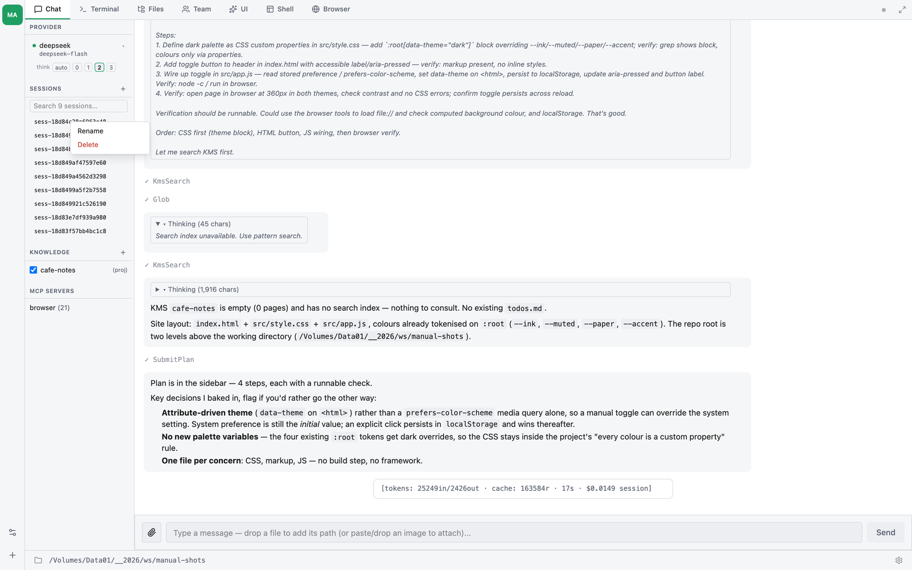

# บทที่ 7 — เซสชัน (Sessions)

**เซสชัน** คือบทสนทนาต่อเนื่องหนึ่งชุดระหว่างคุณกับ thClaws ซึ่งเก็บข้อมูลไว้ดังนี้


- ประวัติข้อความทั้งหมด (คำสั่งจากผู้ใช้ คำตอบของผู้ช่วย และการเรียกใช้ tool)
- โมเดลและ provider ที่ใช้งานอยู่
- วันที่สร้าง working directory และชื่อ (title) ที่อ่านเข้าใจได้ ซึ่งจะใส่หรือไม่ก็ได้
- จำนวน token ที่สะสมตลอดบทสนทนา

เซสชันถูกจัดเก็บเป็น **append-only JSONL files** โดยมีหนึ่งเหตุการณ์ต่อหนึ่งบรรทัด จึงตรวจสอบ ดู diff และกู้คืนจากการเขียนที่ไม่สมบูรณ์ได้ง่าย

## เซสชันถูกเก็บไว้ที่ไหน

เซสชันเป็นแบบ **project-scoped** โดยเก็บไว้ที่ `./.thclaws/state/sessions/`
ภายใน working directory ของคุณ หากเปิด thClaws ในโฟลเดอร์ใหม่เอี่ยม
รายการเซสชันก็จะว่างเปล่า

เซสชันแต่ละอันเป็นไฟล์ `.jsonl` หนึ่งไฟล์ ตั้งชื่อตาม ID ของตัวเอง ซึ่งเป็น
hex string สั้น ๆ ที่สร้างจาก nanosecond wall-clock ตอนสร้าง (เช่น
`sess-181a2c7f4e3d5`) จะเปิดดู ย้าย ส่งอีเมล หรือ commit ได้
เหมือนไฟล์ข้อความทั่วไป

## การบันทึกอัตโนมัติ (Auto-save)

ทุกคำตอบของ AI จะถูก flush ลงไฟล์เซสชันทันทีที่เข้ามา ไม่จำเป็นต้องสั่งบันทึกเอง หาก thClaws crash กลางคำตอบ ไฟล์เซสชันก็ยังมีข้อมูลครบจนถึงเหตุการณ์สุดท้ายที่เสร็จสมบูรณ์

## `/save` — บังคับบันทึกโดยไม่มีผลข้างเคียง

```
❯ /save
saved → ./.thclaws/state/sessions/s-4f3a2b1c.jsonl
```

`/save` จะบังคับ flush ข้อมูล มีประโยชน์ก่อนรันคำสั่งที่เสี่ยง เพื่อให้มั่นใจว่าไฟล์บนดิสก์ตรงกับในหน่วยความจำ

โดยปกติแล้วไม่จำเป็นต้องเรียกใช้

## `/sessions` — แสดงรายการเซสชันที่บันทึกไว้

```
❯ /sessions
  s-4f3a2b1c · claude-sonnet-4-6 · 23 msg
  refactor-auth · claude-sonnet-4-6 · 87 msg
  s-9a8b7c6d · gpt-4o · 12 msg
```

แสดงเซสชันล่าสุดได้สูงสุด 20 รายการ เซสชันที่ตั้งชื่อไว้จะขึ้นชื่อ ส่วนเซสชันที่ไม่มีชื่อจะขึ้น UUID แทน

## `/load` — กลับมาใช้งานเซสชันด้วย ID หรือชื่อ

```
❯ /load s-4f3a2b1c
loaded s-4f3a2b1c (23 message(s))

❯ /load refactor-auth
loaded refactor-auth (s-9a8b7c6d) (87 message(s))
```

รับได้ทั้ง session ID แบบเต็ม (หรือจะใช้แค่ prefix ของ UUID ก็ได้) และชื่อ (ต้องตรงทุกตัวอักษร) คำสั่งนี้จะแทนที่ประวัติของ agent ปัจจุบันด้วยข้อความที่โหลดเข้ามา turn ต่อ ๆ ไปจึงต่อจากจุดที่เซสชันเดิมค้างไว้

## `/rename` — ตั้งชื่อเซสชันให้อ่านง่าย

```
❯ /rename refactor-auth
session renamed → refactor-auth

❯ /rename
session title cleared
```

เซสชันที่มีชื่อจะหาเจอได้ง่ายขึ้นผ่าน `/load` หรือใน sidebar หากเรียก `/rename` โดยไม่ใส่ argument จะเป็นการลบชื่อแล้วกลับไปใช้ UUID

เหตุการณ์การเปลี่ยนชื่อจะถูก append ต่อท้ายไฟล์ JSONL เดิมในรูปแบบ `{"type":"rename", "title": "..."}` ชื่อจึงติดไปกับเซสชันเสมอ

## Sidebar (GUI)

ส่วน **Sessions** ของ sidebar จะแสดงเซสชัน 10 รายการล่าสุด โดย
เซสชันที่มีชื่อจะขึ้นก่อน เซสชันปัจจุบันจะถูกไฮไลต์ด้วยแถบสี accent
ด้านซ้าย + พื้นหลังจาง ๆ และตัวหนา เพื่อให้รู้ได้ทันทีว่ากำลังคุยอยู่กับอันไหน
แต่ละแถวทำได้ดังนี้:

- **คลิก** → โหลดเซสชัน ถ้าเซสชันถูกบันทึกไว้กับ provider คนละค่ายกับที่
  กำลังใช้อยู่ thClaws จะ **auto-switch provider/model** ให้ตรงกันก่อน
  replay (มี toast "auto-switched to …"); ถ้า provider ของ session
  นั้นยังไม่ได้ตั้ง API key ไว้ ระบบจะ **ปฏิเสธการ load** พร้อม error แทน
  (ดู[บทที่ 6](ch06-providers-models-api-keys.md#การสลับ-provider))
- **คลิกขวา** → เปิดเมนู context 2 รายการ
- **`+`** ที่ header ของส่วนนี้ → เริ่มเซสชันใหม่ (บันทึกเซสชันปัจจุบัน
  ให้อัตโนมัติก่อน)



เมนูที่ได้จากคลิกขวา:

- **Rename** — เปิด modal ช่อง input ให้พิมพ์ชื่อใหม่ (ปล่อยว่างเพื่อลบชื่อ)
  กด Enter เพื่อบันทึก, Esc หรือคลิกด้านนอกเพื่อยกเลิก เหตุการณ์ rename
  จะถูก append ต่อท้าย JSONL เหมือน `/rename` ปกติ
- **Delete** — เปิด native OS confirm dialog ยืนยันก่อนลบ ถ้ายืนยัน
  ไฟล์เซสชันใน `.thclaws/state/sessions/` จะถูกลบออก (undo ไม่ได้)

## `--resume` — CLI flag สำหรับสคริปต์

เมื่อเปิดจาก shell คุณสามารถ resume เซสชันที่ต้องการ หรือเซสชันล่าสุด ได้โดยไม่ต้องเข้า REPL ก่อน

```sh
# Resume a specific session by ID or title
thclaws --resume refactor-auth

# Resume whatever session was active most recently
thclaws --resume last
```

ถ้าไม่พบเซสชัน จะมีคำเตือนแบบเป็นมิตรขึ้นมา แล้ว thClaws จะเริ่มเซสชันใหม่ให้

## เซสชันใหม่ — ถูกสร้างเมื่อใด

เซสชันใหม่จะเกิดขึ้นอัตโนมัติเมื่อ

- คุณเปิด thClaws จากศูนย์ (ไม่ได้ใช้ `--resume`)
- คุณรัน `/provider <name>` (สลับ provider family เสมอ)
- คุณกดปุ่ม `+` ที่ส่วน Sessions ของ sidebar
- คุณรัน `/fork` (หรือกด Fork with summary บน banner) — เหมือนกด `+`
  แต่ session ใหม่ seed ด้วย summary ของประวัติเดิม ไม่ใช่เริ่มจากศูนย์

`/model` **ไม่ fork เซสชันอีกแล้ว ไม่ว่าจะข้าม family หรือไม่** — JSONL
คือประวัติหลัก และ provider ตัวไหนที่รับเทิร์นถัดไปจะเป็นคนแปลเอง
session id กับไฟล์จึงคงเดิม ข้อความยืนยันจะบอกว่า
`conversation preserved in session …` (เวอร์ชันก่อนหน้า fork ทุกครั้งที่
สลับโมเดล พฤติกรรมนั้นถูกยกเลิกแล้ว)

ส่วน `/provider` **ยังคง fork** เพราะการเปลี่ยน provider คือการสร้าง
`Agent` ตัวใหม่ทั้งตัว ไม่ใช่แค่เปลี่ยนป้ายชื่อโมเดลของตัวเดิม
ดูรายละเอียดเพิ่มเติมใน[บทที่ 6](ch06-providers-models-api-keys.md)

เซสชันก่อนหน้าจะถูก auto-save ก่อน fork จึงไม่มีอะไรสูญหาย

## Compaction: ทำให้เซสชันขนาดใหญ่ยังจัดการได้

thClaws คุม context ของเซสชันให้อยู่ในขอบของ context window ของ
provider ด้วย **compaction** สองระดับ

### Auto-compact ที่ 80%

เมื่อประวัติสะสมเกิน **80% ของ context window** ของโมเดลปัจจุบัน thClaws
จะตัดข้อความเก่าที่สุดออกอัตโนมัติ (แบบ drop-oldest ไม่ต้องเรียก LLM)
ก่อน turn ถัดไปจะส่งไปยัง provider ทำให้คำขอไม่เคยเกินขนาด context
จริง ๆ

- เกณฑ์ 80% ใช้ **context window จริงของแต่ละโมเดล** ดึงจาก model
  catalogue (เช่น Claude Sonnet 4.6 = 200k, Gemini 2.5 Pro = 2M,
  GPT-4o = 128k) ดู[บทที่ 6 — section "Model catalogue"](ch06-providers-models-api-keys.md)
- หลังการ compact จะมีข้อความ dim ขึ้นใน Terminal/Chat เช่น
  `[compacted: 48 → 18 messages — context over 80% of budget]`
  เพื่อให้รู้ว่า agent เริ่มลืมข้อความเก่า
- checkpoint ของการ compact จะถูกเขียนลงในไฟล์ JSONL ของเซสชัน
  (event type `compaction`) การ `/load` ครั้งต่อไปจะอ่านจาก checkpoint
  ล่าสุดเป็นจุดเริ่มต้น ไม่ต้องให้ agent มา compact ซ้ำทุกรอบ
- เนื้อหาก่อน checkpoint ยังอยู่ในไฟล์เดิม (append-only) สำหรับตรวจสอบ
  ย้อนหลัง

### เช็คว่าใช้ context ไปเท่าไรแล้ว: `/context`

รันได้ทุกเมื่อเพื่อดูสถานะปัจจุบันของ context window

```
❯ /context
context: 10 message(s), 14 content block(s), system prompt 16701 chars
model: claude-sonnet-4-6 · window: 200k tokens · used: ~4.6k tokens
[██░░░░░░░░░░░░░░░░░░░░░░] 2.3%
```

บรรทัดสุดท้ายคือ progress bar สี — **เขียว** เมื่อใช้ไม่เกิน 60%,
**เหลือง** ระหว่าง 60–80%, และ **แดง** เมื่อ ≥ 80% (ซึ่งเป็น threshold
ที่ auto-compact จะเด้งในรอบถัดไป) จึงดูจากสีเดียวก็พอจะรู้ว่าควร
ปล่อยให้ทำงานต่อ, รัน `/compact` เอง, หรือคิดเรื่อง `/fork`

ค่าจำนวน token เป็นค่าประเมินที่ใช้ `~4 chars / token` ตามกฎทั่วไป
อาจคลาดเคลื่อนได้กับเนื้อหาที่ token dense (โค้ด, ตาราง) ให้เผื่อ
ขอบเล็กน้อยเวลาวางแผน

### `/compact` — บังคับทำล่วงหน้า

เรียกใช้เองเมื่อเดาว่าจะต้องใช้ context หนักในรอบต่อไป (เช่น ขอให้
agent อ่านไฟล์ขนาดใหญ่):

```
❯ /compact
compacted: 24 → 12 messages (checkpoint saved)
```

การตอบสนองเหมือน auto-compact ทุกประการ — drop-oldest, เขียน
checkpoint ลง JSONL การเรียกครั้งต่อไปหลัง `/load` จะเริ่มจาก
checkpoint ตัวหลังสุด

### Fork เมื่อไฟล์ใหญ่เกิน 5 MB

แม้ compaction ตัดข้อความในหน่วยความจำแล้ว ไฟล์ JSONL ของเซสชันยัง
คงขยายเรื่อย ๆ เพราะเก็บของเดิมไว้ทั้งหมด (เป็น audit trail) thClaws จึง
เฝ้าดูขนาดไฟล์ และเมื่อเกิน **5 MB** จะขึ้น banner **หนึ่งครั้งต่อเซสชัน**
ชวนให้ fork ไปเซสชันใหม่ที่มีแค่สรุปของประวัติ + turn ล่าสุด


ปุ่ม **Fork with summary** จะเรียกคำสั่ง `/fork` ที่:

1. บันทึกเซสชันเดิมลงดิสก์ให้ครบ (ยังคลิกจาก sidebar ได้เสมอ)
2. เรียก LLM ให้สรุปประวัติเก่า (ใช้ `compact_with_summary` ที่ให้
   summary message + 4 turn ล่าสุดแบบคำต่อคำ)
3. สร้าง session ใหม่ (id ใหม่) seed ด้วย summary history
4. ทำให้เป็น session ปัจจุบัน sidebar เลื่อน highlight ไปที่อันใหม่
5. ถ้า LLM summary ล้มเหลว จะ fallback ไป drop-oldest อัตโนมัติ พร้อม
   แจ้ง `(summary unavailable — used drop-oldest)`

ใน CLI / Terminal tab ยังเรียก `/fork` ตรง ๆ ได้ทุกเมื่อ

## เซสชันกับแท็บ Chat บน GUI

แท็บ Chat และแท็บ Terminal ใช้เซสชันที่ active อยู่ร่วมกัน การโหลดเซสชันจาก sidebar จะอัปเดตทั้งสองแท็บไปพร้อมกัน เมื่อจบ turn ในแท็บหนึ่งก็จะไปปรากฏในอีกแท็บด้วย เพราะเบื้องหลังทั้งคู่เป็น client ของ `Agent` instance เดียวกัน

## ตรวจสอบเซสชันบนดิสก์

เซสชันเป็นแค่ JSONL ธรรมดา แอบเปิดดูได้ด้วยคำสั่ง

```sh
cat .thclaws/state/sessions/s-4f3a2b1c.jsonl | head -5
```

บรรทัดแรกคือ header: `{"type":"header","id":"s-4f3a2b1c","model":"claude-sonnet-4-6","cwd":"...","created":"..."}` บรรทัดถัด ๆ ไปจะเป็นข้อความและเหตุการณ์ต่าง ๆ

event type ที่จะพบเห็นได้

- `{"type":"header", ...}` — มีครั้งเดียวที่ด้านบนสุด
- `{"type":"message", "role":"user"|"assistant", "content":[...]}` — turn จริง
- `{"type":"rename", "title":"..."}` — การเปลี่ยนชื่อ
- `{"type":"plan_snapshot", ...}` / `{"type":"goal_snapshot", ...}` —
  checkpoint ของ sidebar (latest wins on load)
- `{"type":"compaction", "messages":[...], "replaces_count":N, ...}` —
  checkpoint ของ auto-compact หรือ `/compact` บรรทัด message ก่อนหน้ายัง
  อยู่ในไฟล์เพื่อ audit แต่การ `/load` ถัดไปจะใช้ messages ใน
  checkpoint ล่าสุดเป็นจุดเริ่มต้น
- `{"type":"provider_state", "provider_session_id":"uuid-..."}` —
  conversation id ฝั่ง provider (`anthropic-agent` only — ดูด้านล่าง)

## Resume เซสชัน `anthropic-agent`

Provider `anthropic-agent` (Anthropic Agent SDK subprocess; ใช้เมื่อเลือก model อย่าง `claude-sonnet-4-6@agent-sdk`) เก็บประวัติบทสนทนา **ฝั่ง server เอง** อ้างอิงด้วย UUID ที่ส่งกลับมาตอน response แรก thClaws จะ capture UUID นั้นและบันทึกเป็น event `provider_state` ใน JSONL ของเซสชัน เมื่อ `/load` หรือ `/resume` เซสชันนั้นในครั้งถัดไป provider จะได้ UUID กลับผ่าน `Provider::set_provider_session_id` และ turn ถัดไปจะส่ง `--resume <uuid>` ไปยัง subprocess. SDK กู้ประวัติฝั่ง server กลับมา model จึงเห็นบทสนทนาก่อนหน้าครบ

ก่อน fix นี้ hop นี้หายไป — UUID อยู่แค่ในหน่วยความจำ ถ้าปิด thClaws แล้วเปิดใหม่ SDK จะเริ่ม conversation ใหม่หมด เห็นแค่ user message ล่าสุด model เหมือนลืมทุกอย่าง ถ้าใช้ build เก่ากว่า fix นี้แล้ว resume รู้สึกพัง ให้เริ่ม session ใหม่

UUID นี้**ไม่**แชร์ข้าม provider การสลับจาก `anthropic-agent` ไป `claude/anthropic`, OpenAI, Gemini ฯลฯ จะ fork session ใหม่อยู่แล้ว (ตามกฎด้านบน) ไม่มี state รั่วข้าม provider

## การแชร์หรือ archive เซสชัน

ไฟล์เซสชันเป็น self-contained — ส่งอีเมล commit หรือย้ายไปที่ไหนก็ได้ หากคัดลอกไปไว้ใน sessions directory ของเครื่องอื่น ก็จะไปปรากฏใน `/sessions` และ sidebar ทันที

หากต้องการลบเนื้อหาที่ sensitive ออกก่อนแชร์ ให้แก้ไฟล์ JSONL ตรง ๆ ได้เลย เพราะแต่ละบรรทัดเป็น standalone การลบบรรทัดใดบรรทัดหนึ่งจะไม่กระทบบรรทัดอื่น

[บทที่ 8](ch08-memory-and-agents-md.md) ครอบคลุมเรื่องความรู้ระยะยาว ซึ่งเป็นพี่น้องของเซสชัน ได้แก่ persistent memory และ project instructions ผ่าน `AGENTS.md`
