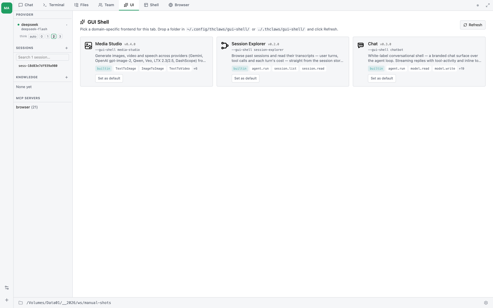

# บทที่ 26 — GUI Shells

GUI Shell ให้คุณเปลี่ยน view ของ Chat / Terminal เป็น **frontend
HTML ที่ออกแบบเฉพาะ domain** — grid สำหรับ image generation,
dashboard trading, ตัวสร้าง campaign โฆษณา หรืออะไรก็ได้ Shell
ถูก render อยู่ใน iframe ที่ sandbox และคุยกับ agent ผ่าน bridge
เล็ก ๆ ชื่อ `window.thclaws.*` Built-in shell มากับ thClaws ส่วน
custom shell คือ folder ที่คุณวางลงดิสก์ shell ตัวเดียวกันยัง
serve ขึ้น cloud ที่ URL พร้อม token ได้ด้วย ทำให้ใช้จาก browser
บนมือถือหรือแชร์ให้เพื่อนร่วมทีมได้




> **สถานะ:** Tier 1 ลง v0.24 (Session Explorer + tab loader);
> Tier 2 เพิ่ม picker, custom shell, และ `--serve --gui-shell`;
> Tier 3 เพิ่ม SDK, permission, และ marketplace ดู
> [dev-plan/33](../dev-plan/33-gui-shell.md) สำหรับ roadmap เต็ม
> หัวข้อด้านล่างจะติด tag ว่าแต่ละความสามารถลงที่ tier ไหน

## ควรใช้ GUI Shell เมื่อไร

ใช้ GUI Shell เมื่องานมี **วิธีแสดงผลที่ดีกว่า chat transcript**
และ user อยากโต้ตอบผ่านการแสดงผลนั้น ไม่ใช่พิมพ์ prompt:

- สร้างรูป — grid ของรูปที่สร้างก่อนหน้าดีกว่า scroll chat เพื่อ
  ดูว่า "ฉันสร้างอะไรไปบ้าง"
- รีวิว agent session ยาว ๆ — tree ของ tool-call ดีกว่า scroll
  เป็นเส้นตรงเพื่อหา "มันเรียก `bq_query` ที่ไหน"
- สร้าง ad campaign — form ของ targeting filter ดีกว่าพิมพ์
  อธิบายเป็นข้อความ

อยู่กับ **Chat** (บทที่ 4) ต่อไปเมื่อ workflow เป็นแบบสนทนาและเป็น
text เป็นหลัก อยู่กับ **Terminal** (บทที่ 4) เมื่ออยากได้ raw
ANSI stream GUI Shell เป็นของเพิ่ม ไม่ใช่ของแทนที่ทั้งคู่

## สอง delivery mode

ทุก shell รันได้ใน 2 ที่ ผู้เขียน shell เขียน code ชุดเดียว
ผู้ใช้เลือก surface เอง

| Mode | รันที่ไหน | URL surface | Auth | Bridge transport |
|---|---|---|---|---|
| **A** Desktop tab | thClaws GUI app | `thclaws://` custom protocol | desktop session | `window.ipc.postMessage` |
| **B** Serve / cloud | `--serve` listener | `https://host/t/<token>/` | per-shell token ใน path | WebSocket |

Mode A เป็น default Mode B (Tier 2) ใช้สำหรับเรียก shell จากที่
อื่น — มือถือ เพื่อนร่วมทีม หรือ server แบบ headless

---

## Mode A — เปิด shell ใน desktop GUI

### Tier 1 — built-in อย่างเดียว

1. เปิด thClaws (`thclaws` หรือ `cargo run --features gui --bin
   thclaws`)
2. คลิก **"+ New Tab" → "Open Session Explorer"** (Tier 1 ส่ง
   built-in shell ตัวเดียวต่อตรงเข้า new-tab menu ส่วน picker
   สำหรับเลือกระหว่าง shell ลง Tier 2)
3. Tab จะเปิดพร้อม UI ของ Session Explorer คลิก session ทาง
   ซ้าย คลิก node ของ tool-call ใน tree เพื่อกาง คลิก
   "Summarise" ให้ agent อธิบาย call นั้นใน 1 บรรทัด
4. ปิด tab → session ของ shell ถูก persist ที่
   `./.thclaws/state/sessions/<id>.jsonl` (ที่เดียวกับ session ของ
   Chat/Terminal เพิ่ม field `shell: { id, version }` ใน
   metadata — ยัง `cat` ได้ปกติ)
5. เปิดใหม่ภายหลัง → เลือก session เดิมจาก Sessions browser
   shell จะเปิดพร้อม state เดิม

### Tier 2 — picker + custom shell

หลัง Tier 2:

1. **"+ New Tab" → "GUI Shell"** เปิด **picker grid** แสดง shell
   ทุกตัวที่ติดตั้ง — built-in, user-level (`~/.config/thclaws/
   gui-shell/`), และ project-level (`./.thclaws/gui-shell/`)
2. ทุก card แสดง icon, ชื่อ, version, source (`builtin` / `user`
   / `project`), permission ที่ประกาศไว้ และ session ที่ผ่านมา
   ของ shell นั้น (resume ได้คลิกเดียว)
3. คลิก card → shell ที่เลือกแทนที่ picker ใน Shell tab — Mode A
   เปิดได้ทีละ shell ใน v0.24, multi-instance shell tabs ยังอยู่ใน
   release ถัดไป (ส่วน multi-tenant `--serve` สำหรับ host shell
   เดียวให้ผู้ใช้หลายคนได้ลงแล้ว — ดูหัวข้อ "Multi-tenant" ด้านล่าง)
   ใช้ breadcrumb "shells" เพื่อกลับมา picker แล้วเลือก shell อื่น
4. ปุ่ม **"Refresh shells"** rescan folder discovery โดยไม่ต้อง
   restart thClaws

### ตั้ง default shell

ถ้าอยากให้ shell ตัวใดตัวหนึ่งเปิดเสมอเมื่อคลิก "New GUI Shell"
ตั้งใน `settings.json`:

```jsonc
// ./.thclaws/settings.json  (project — ชนะ)
// หรือ ~/.config/thclaws/settings.json  (user — fall through)
{ "guiShell": "session-explorer" }
```

แบบยาว ใช้เมื่อ default ของ desktop กับ serve ต่างกัน:

```jsonc
{
  "guiShell": {
    "tabDefault":   "session-explorer",   // ใช้กับ Mode A "New Shell"
    "serveDefault": "my-image-bot"      // ใช้กับ fallback ของ Mode B --serve
  }
}
```

## Media Studio shell  *(built-in)*

thClaws มี shell มาให้สามตัว — **Session Explorer**, **Chatbot** และ
**Media Studio** โดย Media Studio เป็นหน้าจอแบบคลิก ๆ สำหรับเครื่องมือ
สร้างภาพและวิดีโอ (บทที่ 11) ให้สร้างสื่อได้โดยไม่ต้องพิมพ์ tool call ในแชต

เปิดจาก picker ของ GUI Shell (`media-studio`) หรือ pin ไว้:

```jsonc
// ./.thclaws/settings.json
{ "guiShell": "media-studio" }
```

มันทำอะไรได้:

- **สลับโหมด** — Text → Image, Image → Image (แก้ภาพ), Text → Video,
  Image → Video
- **เลือก provider / model** พร้อมตัวควบคุม **resolution** สำหรับวิดีโอ
  (720P / 1080P)
- **แกลเลอรี** ของทุกอย่างที่อยู่ใน `output/` อยู่แล้ว (ไม่ใช่แค่ที่เพิ่ง
  สร้าง) — คลิกชิ้นไหนก็ได้เพื่อตั้งเป็นภาพต้นทางของงาน Image → Image หรือ
  Image → Video หรือคลิกเพื่อเปิดดูใน lightbox
- **วิดีโอ async** จัดการให้อัตโนมัติ — shell จะ submit งานแล้ว poll
  `MediaJobStatus` จนคลิปเสร็จ แล้วหย่อนลงแกลเลอรี

Media Studio **เปิด media tools ให้อัตโนมัติ** สำหรับ session ของมันเอง
จึงไม่ต้องตั้ง `mediaToolsEnabled` ก่อน — แต่ยังต้องมี key ของ provider
ที่เกี่ยวข้อง (`GEMINI_API_KEY` / `OPENAI_API_KEY` / `DASHSCOPE_API_KEY`
ดูบทที่ 11) ใน environment หรือ keychain

---

## Mode B — serve shell ขึ้น cloud  *(Tier 2)*

ใช้สำหรับเปิด shell จากมือถือ แชร์ให้เพื่อนร่วมทีม หรือรันบน
server

### เรียกใช้

```sh
thclaws --serve --gui-shell my-image-bot --port 8080
```

stdout:

```
Serving My Image Bot (v0.1.0) at
  https://localhost:8080/t/abc...xyz/
Token persisted to ~/.config/thclaws/gui-shell-tokens.json
```

เปิด URL นั้นใน browser ตัวไหนก็ได้ จะมี landing flash บอก
`Connecting to: my-image-bot v0.1.0 on <host>` แล้ว shell
render เต็มหน้า — UI เดียวกับ Mode A bridge เดียวกัน แค่
WebSocket อยู่ข้างใต้แทน Tauri IPC

### Token คือ credential

- URL `https://host:8080/t/<token>/` คือทุกอย่างที่ต้องใช้ ใครมี
  ก็เข้าได้ ใครไม่มีจะได้ 404 เงียบ ๆ (server ไม่บอกด้วยซ้ำว่ามี
  shell bound อยู่)
- Token ถูกสร้างตอน launch ครั้งแรกและ **persist** ที่
  `~/.config/thclaws/gui-shell-tokens.json` key เป็น `(shellId,
  port)` restart `--serve` จะได้ URL เดิม การแชร์ครั้งเดียวเลย
  ใช้ได้นาน
- URL ตรง ๆ อย่าง `/gui-shell/session-explorer/` หรือ `/shells/`
  จะคืน 404 มีแค่ shell ที่ launch ด้วย `--gui-shell` เท่านั้นที่
  เข้าถึงได้ และเข้าได้ผ่าน `/t/<token>/` เท่านั้น

### Pin token (สำหรับ deployment)

สำหรับ k8s manifest หรือ systemd unit ที่ต้องการ URL คงที่:

```sh
thclaws --serve \
        --gui-shell my-image-bot \
        --gui-shell-token "$MY_TOKEN" \
        --gui-shell-token-ttl 90d \
        --port 8080
```

### Rotate

ถ้า URL หลุดหรืออยากยกเลิกการแชร์:

```sh
thclaws shell rotate-token my-image-bot
# → พิมพ์ URL ใหม่ URL เก่าหยุดทำงานทันที
```

### No-auth mode (localhost / intranet เท่านั้น)

```sh
thclaws --serve --gui-shell my-image-bot --gui-shell-no-auth
```

Route ขึ้นที่ `/` ตรง ๆ — ไม่มี prefix `/t/<token>/` default จะ
ปฏิเสธการ bind บน address ที่ไม่ใช่ loopback ถ้าอยากเปิด
unauthenticated บน public IP (ควรรู้ว่ากำลังทำอะไร — ปกติต้องมี
auth proxy ของคุณเองอยู่หน้า):

```sh
thclaws --serve --gui-shell my-image-bot \
        --gui-shell-no-auth --gui-shell-no-auth-allow-public \
        --bind 0.0.0.0 --port 8080
```

Pattern guardrail เดียวกับ `--dangerously-skip-permissions`
(บทที่ 5)

### Serve default จาก `settings.json`

ถ้าไม่ใส่ `--gui-shell` launcher จะอ่าน `guiShell.serveDefault`
(หรือ shorthand `guiShell` ถ้าเป็น string) จาก `settings.json`
ถ้าไม่ได้ตั้ง `--serve` จะทำงานเดิม — serve React frontend ปกติ

### Multi-tenant — shell เดียว, ผู้ใช้หลายคน

ทุกอย่างข้างต้น ("Mode B") เป็น **single-tenant** — ทุกคนที่เข้า
URL เดียวกันจะแชร์ agent / session / storage ก้อนเดียว
เหมาะตอนแชร์ shell ให้เพื่อนร่วมทีมหรือใช้กับมือถือตัวเอง

ถ้าอยาก *host* shell ให้ผู้ใช้หลายคน — ต่างคนต่างมีบทสนทนา
gui-shell storage และไฟล์ output ของตัวเอง — เพิ่ม `--multi-tenant`
กับ HMAC secret ที่แชร์กัน:

```sh
thclaws --serve --gui-shell my-image-bot \
        --multi-tenant \
        --multi-tenant-secret "$THCLAWS_CLOUD_HMAC_SECRET" \
        --port 8080
```

(`--multi-tenant-secret` รับจาก env `THCLAWS_CLOUD_HMAC_SECRET`
ได้ด้วย — รูปแบบที่ใช้ตอน deploy จริง)

โหมดนี้คาดว่า request มาจาก routing layer ที่เชื่อถือได้
(ปกติคือ thClaws.cloud) ซึ่งจะแนบ 3 header ที่เซ็นแล้วมาทุก request:

```
X-Thclaws-User:       <user_id>           # filesystem-safe, [a-zA-Z0-9_-], ≤64 ตัว
X-Thclaws-User-Ts:    <unix_seconds>
X-Thclaws-User-Proof: hex(HMAC-SHA256(secret, "<user_id>:<ts>"))
```

สิ่งที่จะได้:

- **Agent + session แยกต่อ user** — alice กับ bob ใน pod เดียวกัน
  ต่างคนต่างมีบทสนทนา
- **Storage แยกต่อ user** — `thclaws.storage.set("notes", …)` ของ
  alice ไป `users/alice/storage/<shell>/…` ของ bob ไป
  `users/bob/...` ไม่ชนกันบน key เดียวกัน
- **Output แยกต่อ user** — ไฟล์ที่ agent สร้างไปอยู่ที่
  `output/users/<id>/...` และ file-asset URL จะไม่ serve subtree
  ของ user อื่นแม้จะเดา URL ได้
- **LRU + idle eviction** — `--multi-tenant-max-users 1000` (default)
  กับ `--multi-tenant-idle-timeout 30m` (default) คุม resource
- **Restart-resumable** — session JSONL ของ alice รอด pod restart
  เมื่อ alice เชื่อมต่อใหม่บทสนทนาเดิมจะโหลดกลับมาจาก disk

Shell author เขียน **shell เหมือนเดิม** เป๊ะกับ single-tenant Mode B
— ไม่ต้องแก้ code อะไร bridge จะ route storage / file-asset
ผ่าน prefix ต่อ user ให้อัตโนมัติ

นี่คือสิ่งที่อยู่เบื้องหลัง thClaws.cloud (dev-plan/34)
สำหรับ contract เต็ม — สูตรเซ็น HMAC, layout บน disk, semantics
ของ registry, curl smoke recipe, และสิ่งที่ Tier 1 ยังไม่มี
(object storage, cross-pod state portability, cgroup-style
resource limits) — ดู
[`thclaws-technical-manual/multi-tenant-serve.md`](../thclaws-technical-manual/multi-tenant-serve.md)

---

## ติดตั้ง custom shell  *(Tier 2)*

Shell ก็คือ folder วางที่ใดที่หนึ่งใน 2 ที่:

```
~/.config/thclaws/gui-shell/<id>/      # cross-project ทุก workspace เห็น
./.thclaws/gui-shell/<id>/              # repo-scoped project override โดย id
```

Folder ต้องมี:

```
<id>/
  manifest.json         # ดูด้านล่าง
  index.html            # entry point — bridge ถูก inject ตอน serve
  ...                   # CSS / JS / รูป / font อะไรก็ได้
```

`manifest.json` ขั้นต่ำ:

```json
{
  "id": "hello-shell",
  "name": "Hello Shell",
  "version": "0.1.0",
  "description": "Smallest possible shell.",
  "entry": "index.html",
  "icon": "icon.svg",
  "minBridgeVersion": "1",
  "permissions": ["agent.run"]
}
```

ใน GUI: เปิด picker คลิก **"Refresh shells"** — shell ของคุณจะ
ปรากฏข้าง built-in

**Project shell จะ override user shell** ที่ id เดียวกัน เหมาะ
เมื่อทีมอยากแจกเวอร์ชัน customise ของ public shell ให้ทุกคนใน
repo

### Tier 3 — ติดตั้งจาก git URL

```sh
thclaws shell install https://github.com/someone/cool-shell
thclaws shell install ./mything --scope project   # default: user
thclaws shell list
thclaws shell remove cool-shell
```

ตอน install ครั้งแรก จะมี permission prompt สรุปสิ่งที่ shell
ประกาศว่าต้องใช้:

> *"Shell ตัวนี้ต้องการ: รัน agent, เรียก
> `mcp__pinn_ai__text2image`, เก็บข้อมูลใน
> `<shell-root>/state/`, อ่าน session ของคุณ อนุญาตหรือไม่?"*

Grant ถูก persist ที่ `~/.config/thclaws/gui-shell-grants.json`
(user-scoped — เพื่อนที่ clone repo ไม่ inherit การตัดสินใจของ
คุณ) เพิกถอนได้จาก context menu ของ picker หรือผ่าน
`thclaws shell remove`

---

## เขียน shell ของตัวเอง  *(Tier 3)*

Shell คือ HTML + CSS + JS ไม่ต้องมี build step

### Starter template

```sh
thclaws shell new dashboard ./my-shell     # scaffold จาก template
thclaws shell preview ./my-shell           # serve พร้อม hot reload
```

`shell new` รับ template id — `chat-enhanced`, `grid`, `form`,
`dashboard`, `kanban`, `document`, `report` — แล้วเขียน shell ที่ใช้งานได้
ลงในโฟลเดอร์ปลายทาง (ถ้าโฟลเดอร์ไม่ว่างจะถูกปฏิเสธ เว้นแต่ใส่ `--force`)

`shell preview` รัน shell กับ **mock agent** ที่ `http://localhost:<port>/`
และ reload ทุกครั้งที่ save คุณจึงพัฒนา UI ได้โดยไม่เปลืองโทเคน ใส่
`--port 0` เพื่อให้เลือกพอร์ตว่างให้เอง

คำสั่งที่เหลือสำหรับการพัฒนา

| คำสั่ง | ทำอะไร |
|---|---|
| `thclaws shell check <path>` | lint โฟลเดอร์ แจ้ง warning และ error และ exit 1 ถ้ามี error |
| `thclaws shell pack <path>` | รวมเป็นไฟล์ HTML เดียว โดย inline ไฟล์ข้างเคียงเข้าไป |
| `thclaws shell login` / `logout` | ยืนยันตัวตนสำหรับการ publish |
| `thclaws shell publish <path>` | publish shell |

> **มีชื่อไฟล์ manifest สองแบบ และใช้แทนกันไม่ได้** คำสั่งฝั่งพัฒนา
> (`new` / `preview` / `check` / `pack` / `publish`) อ่าน **`shell.json`**
> ส่วน registry ตอนรัน — ตัวที่ทำให้ shell โผล่ใน picker — ค้นหาโฟลเดอร์จาก
> **`manifest.json`** shell ที่ lint ผ่านแต่ไม่เคยโผล่ใน picker มักเป็นเคสนี้
> คือมี `shell.json` แต่ไม่มี `manifest.json`

### Bridge — `window.thclaws.*`

JavaScript ของ shell จะได้ global ตัวเดียว ทุกอย่างเป็น async

```js
// Identity
thclaws.shell.id          // "hello-shell"
thclaws.shell.sessionId   // session ที่ tab นี้ bound กับ
thclaws.transport         // "tauri" (Mode A) หรือ "ws" (Mode B)

// รัน agent — loop เดียวกับที่ขับ Chat/Terminal
const { runId } = await thclaws.run("Summarise this in one line.");

// ยกเลิก turn ที่กำลังรัน (เทียบเท่า Cmd+. ใน Chat)
thclaws.cancel(runId);

// Subscribe event streaming — on() คืน function สำหรับ unsubscribe
const unsubscribe = thclaws.on("text", (chunk) => render(chunk));
thclaws.on("ready",       ()        => …);   // bridge พร้อม (Mode A)
thclaws.on("tool_call",   (call)   => …);   // Tier 2
thclaws.on("tool_result", (result) => …);   // Tier 2
thclaws.on("done",        ()        => …);
thclaws.on("error",       (err)     => …);

// หรือ consume turn เป็น async stream (น้ำตาลเคลือบ run() + on())
for await (const ev of thclaws.streamTurn("Summarise this.")) {
  if (ev.type === "text") render(ev.delta);
  else if (ev.type === "tool_call") showSpinner(ev.label);
}

// เรียก tool ตรง ๆ — bypass agent loop สำหรับ action ที่ deterministic
// callTool() คือชื่อที่ควรใช้ต่อไป; tools.invoke() เป็น alias เก่า
// พฤติกรรมเหมือนกัน `<name>` คือ tool ที่ register แล้ว — ส่วนใหญ่
// เป็น MCP tool เช่น `mcp__pinn_ai__text2image` (sanitised จาก
// server name) หรือ built-in เช่น `Ls` tool แบบอ่านอย่างเดียวเรียก
// ได้ตรง ๆ; tool ที่แก้ไข (Bash/Write/Edit/…) จะ reject ด้วย
// "requires approval" ส่วนใหญ่แนะนำให้ใช้ thclaws.run() + AGENTS.md
const result = await thclaws.callTool("mcp__your_server__your_tool", { … });

// แปลง path ของไฟล์ที่ agent สร้างให้เป็น URL ที่ browser โหลดได้ —
// เช่น  Mode B รับ path
// relative กับ project root ของ shell; Mode A ต้องเป็น absolute path
// (ไม่งั้นคืน null)
const src = thclaws.fileUrl("output/diagram.svg");

// Storage ของ shell แยกตาม session
// (Tier 2; เก็บเป็นไฟล์ที่ <shell-root>/state/<sessionId>.json)
await thclaws.storage.set("last_query", query);
const last = await thclaws.storage.get("last_query");
await thclaws.storage.delete("last_query");  // ลบ key ออกจริง

// เชื่อมกับ UI ของ host — theme + full-screen bridge mirror theme
// ของ host ไปที่ document.documentElement[data-theme] + color-scheme
// ให้แล้ว shell ส่วนใหญ่จึง theme ด้วย CSS ล้วน ไม่ต้องแตะตรงนี้
thclaws.ui.theme            // "light" | "dark" (theme ที่ host resolve)
thclaws.ui.isFullscreen     // true เมื่อ host แสดง shell แบบ full-screen
thclaws.ui.onTheme((t)   => repaint(t));         // ยิงทันที + เมื่อเปลี่ยน
thclaws.ui.onFullscreen((active) => {            // ยิงทันที + เมื่อเปลี่ยน
  myExitButton.hidden = !active;
  if (active) thclaws.ui.claimExitControl();     // ซ่อนปุ่ม exit fallback ของ host
});
myExitButton.onclick = () => thclaws.ui.exitFullscreen();
```

คำขอใด ๆ ที่ host ตอบไม่ได้จะ self-reject หลัง 15 นาที shell จึงไม่มีทาง
ค้างเพราะคำตอบหาย

### ส่วนที่เหลือของ bridge

บล็อกข้างบนคือสิ่งที่ shell ส่วนใหญ่ต้องใช้ นอกเหนือจากนั้น bridge ยังเปิด
หน้าตั้งค่าต่าง ๆ ของแอปให้ด้วย แต่ละอันมี permission ของตัวเอง — shell จึง
เป็นแผงควบคุมได้ ไม่ใช่แค่หน้า chat ทุกอย่างเป็น async และอะไรที่ไม่ประกาศไว้
ใน manifest จะ throw ตอนเรียก

| Namespace | Method | Permission |
|---|---|---|
| `thclaws.sessions` | `list()` · `load(id)` · `new()` · `rename(id, title)` · `delete(id)` | `session.list` สำหรับ list, `session.read` สำหรับ load, `session.write` สำหรับที่เหลือ |
| `thclaws.model` | `get()` · `list()` · `set(id)` · `onChange(cb)` · `current` | `model.read` / `model.write` |
| `thclaws.mode` | `get()` · `set(mode)` — permission mode (บทที่ 5) | `mode.write` (ทั้งคู่) |
| `thclaws.memory` | `getCore()` · `setCore(text)` | `memory.read` / `memory.write` |
| `thclaws.kms` | `list()` · `browse(name)` · `create(name)` · `ingest(kms, path)` | `kms.read` / `kms.write` |
| `thclaws.research` | `list()` · `get(id)` | `research.read` |
| `thclaws.schedule` | `list()` · `create(prompt, cron)` · `delete(id)` · `setEnabled(id, on)` | `schedule.read` / `schedule.write` |
| `thclaws.heartbeat` | `get()` · `set(interval)` | `schedule.read` / `schedule.write` |
| `thclaws.skills` | `list()` · `get(name)` · `install(url, opts)` · `save(name, body)` · `delete(name)` | `skills.read` / `skills.write` |
| `thclaws.plugins` | `list()` · `install(url, opts)` · `setEnabled(name, on)` · `remove(name)` | `plugins.read` / `plugins.write` |
| `thclaws.connectors` | `list()` · `add({name, url, headers})` · `remove(name)` — MCP server, HTTP เท่านั้น | `connectors.read` / `connectors.write` |
| `thclaws.llm` | `complete({prompt, system, maxTokens})` — เรียกโมเดลครั้งเดียว ไม่มี agent loop ไม่มี tool | `llm.complete` |
| `thclaws.keys` | `set(provider, key)` — **เขียนอย่างเดียว** ไม่มี getter | `keys.write` |
| `thclaws.profile` | `get()` | — |
| `thclaws.permissions` | `list()` · `has(action)` — ถามว่าตัวเองได้สิทธิ์อะไรมา | — |

มีสองตัวที่ควรคิดให้ดีก่อนประกาศ `keys.write` ให้ shell เขียน API key ของ
provider ลง config ของ user ได้ ออกแบบให้เขียนอย่างเดียว shell จึงช่วยตั้งค่า
key ให้ได้ แต่อ่านกลับไม่ได้เลย ส่วน `connectors.write` ให้ shell ลงทะเบียน
MCP server ได้ ซึ่งเท่ากับเพิ่ม tool ให้ agent ของ user — ประกาศต่อเมื่อนั่น
คือสิ่งที่ shell ของคุณมีไว้ทำจริง ๆ

`thclaws.llm.complete` เป็นทางออกสำหรับกรณีที่อยากได้โมเดลแต่ไม่เอา agent —
ไม่มี tool ไม่มี approval ไม่มีประวัติ session มีแต่ completion ถ้าอยากได้
agent loop จริง ๆ ให้ใช้ `thclaws.run()`

Bridge คือ **API ทั้งหมด** Shell แตะ filesystem ของ workspace
ไม่ได้ แตะ network ไม่ได้ (ถ้าไม่ประกาศ `network.outbound:<host>`
ใน Tier 3) และแตะ storage ของ shell อื่นไม่ได้ namespace
`storage` ของ shell 2 ตัวแยกกันโดย id

### Permission (Tier 3)

ประกาศใน `manifest.json::permissions` ว่า shell ทำอะไรบ้าง:

| Permission | อนุญาตให้ |
|---|---|
| `agent.run` | เรียก `thclaws.run()` และ subscribe event |
| `tools.invoke:<name>` | เรียก `thclaws.callTool("<name>", …)` / `thclaws.tools.invoke(…)` ตรง ๆ ทีละ tool |
| `session.read` / `session.list` | อ่านข้อมูล session sidecar |
| `fs.shell-scoped` | read/write ภายใน root ของ shell ตัวเอง |
| `network.outbound:<host>` | `fetch()` ไปยัง host นั้น (CSP inject ตอน serve) |
| `approval.inline` | shell แสดง widget approve/deny ของตัวเอง (`thclaws.approvals.*`) แทน system modal |
| `model.read` / `model.write` | `thclaws.model.*` — ดู / สลับ model |
| `mode.write` | `thclaws.mode.*` — อ่านหรือเปลี่ยน permission mode |
| `memory.read` / `memory.write` | `thclaws.memory.*` — ข้อความ core memory |
| `kms.read` / `kms.write` | `thclaws.kms.*` — browse, create, ingest |
| `research.read` | `thclaws.research.*` — research job |
| `schedule.read` / `schedule.write` | `thclaws.schedule.*` และ `thclaws.heartbeat.*` |
| `skills.read` / `skills.write` | `thclaws.skills.*` — list, install, แก้ไข, ลบ skill |
| `plugins.read` / `plugins.write` | `thclaws.plugins.*` |
| `connectors.read` / `connectors.write` | `thclaws.connectors.*` — ลงทะเบียน MCP server |
| `llm.complete` | `thclaws.llm.complete()` — เรียกโมเดลเปล่า ๆ |
| `keys.write` | `thclaws.keys.set()` — เขียน API key ของ provider (อ่านไม่ได้) |
| `session.read` / `session.list` / `session.write` | `thclaws.sessions.*` |

การประกาศ `tools.invoke:<name>` ตัวใดตัวหนึ่งจะ **จำกัด** ให้ shell เรียกได้
เฉพาะ tool ที่ประกาศ (`tools.invoke:*` = ทุกตัว); ถ้าไม่ประกาศเลยจะเรียกได้ไม่จำกัด

User จะเห็น list นี้ก่อนติดตั้ง อะไรที่ไม่ประกาศจะ throw ตอน call

### การ lint

```sh
thclaws shell check ./my-shell
# ตรวจ: manifest ถูกต้อง, entry มีจริง, permission สมเหตุสมผล,
# ไม่มี Tauri-only API ที่จะพังใน Mode B, ไม่มี external link ที่
# ทำให้ token leak ทาง Referer
```

ถ้ามีอะไรเป็น error จะ exit 1 จึงเอาไปใส่ CI หรือ pre-commit hook ได้เลย
(เอกสารเก่าบางฉบับเรียกคำสั่งนี้ว่า `shell doctor` ตัวจริงคือ `check`)

---

## Session และ persistence

Shell session คือ session ของ thClaws ปกติ format JSONL เหมือนกัน
ที่เดียวกัน (`./.thclaws/state/sessions/<id>.jsonl`) กลไก `--resume`
เดียวกัน เพิ่มแค่ field `shell: { id, version }` ใน session
header ที่เป็น optional — session ที่ไม่ใช่ shell ยังเขียน JSONL
เหมือนเดิมทุกตัวอักษร ดังนั้น `cat` ยังใช้ได้กับทุก session

```sh
# ดู session ของ shell เหมือน session อื่น
cat ./.thclaws/state/sessions/sess-abc123.jsonl | head -3
# {"type":"header","id":"sess-abc123","shell":{"id":"image-generator","version":"0.1.0"},…}
# {"type":"user","content":"generate a picture of a sunset"}
# {"type":"assistant","content":[…]}
```

ปิด tab shell → session ถูก persist เปิดใหม่จาก "Past sessions"
ใน picker → resume ได้ session ที่ stamp `shell.id` ไว้จะเปิดได้
ใน shell ตัวนั้นเท่านั้น ไม่มี view fallback แบบ chat ทั่วไปใน
v1 (เป็น open question ระดับ Tier 3+)

---

## เรื่อง cost

Shell ที่เรียก `thclaws.run()` กิน token เท่ากับ turn ของ Chat
tab Shell ที่เรียก `thclaws.tools.invoke()` ตรง ๆ ข้าม agent loop
ทั้งหมด — ไม่กิน model token สำหรับ call นั้น แค่ค่า tool เอง
(เช่น provider image generation คิดเงิน)

ใน Tier 3 manifest ประกาศ daily token budget ได้ และ permission
prompt จะแสดง ("อนุญาตให้ใช้ได้ถึง 50k tokens/day หรือไม่?") กลไก
budget accounting เดิมจะ track usage shell ที่ใช้เกิน budget จะ
ได้ rejected promise จาก `thclaws.run()`

---

## ช่องว่างที่ยังเหลืออยู่

ทุกอย่างที่แผน tier เดิมบอกว่ายังไม่มี ตอนนี้ ship แล้ว — ทั้ง picker,
custom shell, bridge surface ที่กว้างขึ้น, serve mode, การ enforce
permission และ CLI สำหรับพัฒนา ล้วนอธิบายไว้ข้างบนแล้ว ที่ยังควรรู้คือ

- **`shell.json` กับ `manifest.json`** CLI ฝั่งพัฒนากับ registry ตอนรัน
  อ่านชื่อไฟล์คนละตัว (ดูข้างบน) จนกว่าจะรวมกันได้ shell ที่คุณจะทั้งพัฒนา
  และติดตั้งในเครื่องต้องมีทั้งสองไฟล์
- **Mode B คือ shell ทั้งตัว ไม่ใช่แท็บเดียว** `--serve --gui-shell` เปิด
  shell นั้นตัวเดียวและไม่มีอย่างอื่น ไม่มีวิธี serve ตัว picker เอง
- **ยังไม่มี grid แสดง worker/agent สด ๆ** UI ของ shell แสดงผลลัพธ์ที่
  stream ออกมาได้ แต่ไม่มีแดชบอร์ดรวมของ run ที่รันพร้อมกัน

## Security model — แต่ละ mode ป้องกันอะไรจริง

- **iframe sandbox ของ Mode A** — ทุก shell รันใน `<iframe
  sandbox="allow-scripts allow-same-origin">` shell ที่ buggy เรียก
  `document.location = "…"` จะ navigate parent GUI ไม่ได้ การแยก
  origin ระดับ shell (subdomain ใน custom protocol) กัน shell 2
  ตัวอ่าน cookie / localStorage ของกันและกัน
- **token-in-path ของ Mode B** — token 160-bit ต่อ shell 404
  เงียบเมื่อ token หาย/ผิด (ไม่บอกว่ามี auth) rate limit ต่อ IP
  ใน prefix token Referer ถูกตัด (Permissions-Policy header +
  `<meta name="referrer">`) กัน token หลุดเมื่อ shell link ออก
  ข้างนอก
- **Path traversal** — ทั้ง 2 mode เรียก `Sandbox::check_in
  (&shell_root, &rel)` ตัวเดียวกัน sequence `..` ที่ URL-decode
  แล้วจะ collapse ผ่าน lexical normalize → canonicalize →
  `starts_with` check
- **เรียก tool** — permission gating ของ Tier 3 ทำให้ shell
  เรียก tool ที่ไม่ได้ประกาศไว้ไม่ได้ Permission grant เป็น
  per-shell-per-user เก็บที่ `~/.config/thclaws/gui-shell-grants
  .json` revoke ได้จาก picker

สิ่งที่ **ไม่** ได้ป้องกัน:

- ผู้เขียน shell คุณกำลัง trust code ของเขากับ agent session ของ
  คุณ ไม่มีการ verify จาก marketplace ใน v1 Tier 3 เพิ่ม
  marketplace catalog kind แต่ governance สุดท้ายขึ้นกับว่าคุณ
  ติดตั้งจากใคร
- การเปิดสู่ network ของ `--gui-shell-no-auth-allow-public` flag
  ตั้งชื่อแบบนี้มีเหตุผล — อ่านบทที่ 5 ก่อน

---

## ตารางอ้างอิงเร็ว

| เป้าหมาย | คำสั่ง / ที่ตั้ง |
|---|---|
| ลอง Session Explorer ตอนนี้ (Tier 1) | thClaws GUI → New Tab → Open Session Explorer |
| เปิด shell picker (Tier 2) | thClaws GUI → New Tab → GUI Shell |
| ตั้ง shell default ของ "New Shell" | `"guiShell": "<id>"` ใน `settings.json` |
| ติดตั้ง shell คนอื่น (manual) | วาง folder ใน `~/.config/thclaws/gui-shell/<id>/` → Refresh |
| ติดตั้งจาก git (Tier 3) | `thclaws shell install <git-url>` |
| Serve shell ทาง HTTP (Tier 2) | `thclaws --serve --gui-shell <id> --port 8080` |
| Pin URL ของ serve | เพิ่ม `--gui-shell-token <token>` |
| Rotate URL ที่หลุด | `thclaws shell rotate-token <id>` |
| List shell ที่ติดตั้ง (Tier 3) | `thclaws shell list` |
| เขียน shell ใหม่ (Tier 3) | clone template, `make dev` |
| ลบ shell (Tier 3) | `thclaws shell remove <id>` |
| ดู session ของ shell | `cat ./.thclaws/state/sessions/<id>.jsonl` |

---

## Troubleshooting

**"Tab ของ shell ว่างเปล่า / spinner ค้าง"** — เปิด WebView
devtools (`THCLAWS_DEVTOOLS=1 thclaws`) แล้วดู console ของ iframe
สาเหตุที่พบบ่อย: `index.html` ของ shell มี CSP เข้มที่บล็อก
bridge script ที่ inject เข้าไป (Tier 3 เพิ่ม field manifest
`cspMode: "managed"`) หรือ JS ของ shell throw ก่อนเรียก
`thclaws.on()` ทำให้ไม่ได้ bind event

**"URL ของ Mode B คืน 404"** — ตรวจว่า URL มี prefix
`/t/<token>/` พร้อม trailing slash หรือไม่ token ถูก print ที่
stdout ของ launcher ถ้าหาย ดูที่ `~/.config/thclaws/
gui-shell-tokens.json` URL ที่ไม่มี token จะ 404 ตาม design
(ไม่มี auth challenge บอก)

**"Shell เรียก tool ไม่ได้"** — Tier 3: manifest ไม่ได้ประกาศ
`tools.invoke:<name>` เพิ่มเข้าไป restart thClaws (หรือกด
`Refresh shells`) แล้วอนุมัติ permission ใหม่

**"Shell 2 ตัวใช้ storage ร่วมกัน"** — ไม่ควรเป็นไปได้ ตรวจว่า
`manifest.json::id` ต่างกัน `storage` namespace แยกตาม id ถ้า id
ต่างกันแล้ว storage ยัง leak อยู่ ให้แจ้ง bug — เป็นความล้มเหลว
ของ sandbox

**"Serve แบบ headless ปฏิเสธ start ด้วย `--gui-shell-no-auth`"**
— ตั้งใจ `--gui-shell-no-auth` อนุญาต bind เฉพาะ loopback เพิ่ม
`--gui-shell-no-auth-allow-public` *และ* ยืนยันอีกครั้งว่ามี auth
ของคุณเองอยู่ข้างหน้า

**"`Sandbox::check_in` ปฏิเสธ asset"** — path resolve ออกนอก
folder ของ shell ปกติเกิดจาก URL relative ที่มี `../` เยอะเกิน
หรือ symlink ชี้ออกข้างนอก ทั้ง 2 mode ใช้ check ตัวเดียวกัน —
ถ้าใน desktop tab fail ก็จะ fail ใน serve mode ด้วยเหตุผล
เดียวกัน
