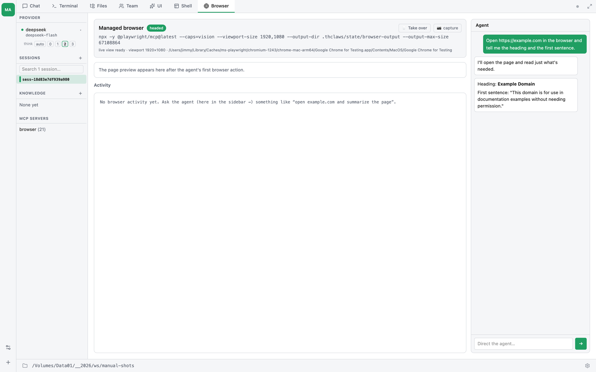

# บทที่ 28 — Browser automation (สั่ง agent ให้ใช้เว็บเบราว์เซอร์)

ให้ agent ของคุณมีเว็บเบราว์เซอร์จริงๆ thClaws ขับ Chromium เต็มตัว
ผ่าน **Playwright MCP** server อย่างเป็นทางการของ Microsoft — agent
เปิดหน้าเว็บ คลิก กรอกฟอร์ม อ่านหน้า และจัดการเว็บที่ใช้ JavaScript
หนักๆ ได้เหมือนคนใช้ ไม่ใช่การเดาพิกัด xy คุณยังมีแท็บ **Browser**
ไว้ดูการทำงาน แทรกเข้าไป login เองได้ แล้วส่งคุมกลับให้ agent ต่อ
(พัฒนาในช่วง v0.48–v0.52)




นี่คือสิ่งตรงข้ามกับเครื่องมือแบบ "computer use" ที่ใช้ภาพหน้าจอ: agent
ทำงานจาก **accessibility tree** ของหน้า (เร็ว แม่น ประหยัด token) และ
ยัง *มองเห็น* พิกเซลที่ render ได้ด้วยเวลาเจอหน้าที่เป็นภาพล้วน

## ใช้เมื่อไหร่ (เทียบกับ WebFetch)

thClaws มี `WebFetch` / `WebScrape` สำหรับดึงหน้าเว็บ static อยู่แล้ว
ให้ใช้ **browser** เมื่อ fetch ทำไม่ได้:

- เว็บที่ต้อง **login** — คุณเซ็นอินครั้งเดียว agent ทำงานในเซสชันคุณ
- แอปที่ใช้ **JavaScript หนัก** — SPA, infinite scroll, เนื้อหาที่โผล่
  หลัง interaction
- **ฟอร์มและ flow หลายขั้น** — การ submit, อัปโหลดไฟล์, dialog
- **"ช่วยแก้ให้หน่อย"** — แพตเทิร์น 12-gram: คุณติดอยู่กับฟอร์มเว็บที่
  เสีย บอก agent ว่า "หาสาเหตุว่าทำไมปุ่ม Submit กดไม่ได้แล้วส่งให้ที"
  มันจะอ่าน HTML, JS, console, network แล้วจัดการให้

ถ้าแค่อ่านบทความ public ครั้งเดียว `WebFetch` เบากว่า

## เปิดใช้งาน

Browser automation **เปิดเป็นค่าเริ่มต้น** ตั้งแต่ v0.49.2 — ทุก
workspace ได้เลยโดยไม่ต้องตั้งค่า ขอแค่มี **Node.js (`npx`) อยู่ใน
PATH** (Playwright เป็น package ของ Node)

ถ้าจะปิด หรือบังคับ headed/headless ตั้งใน `.thclaws/settings.json`:

```json
{
  "browserEnabled": false,        // ปิดทั้งหมด
  "browserHeadless": true          // บังคับ headless แม้บน desktop
}
```

ถ้าไม่ได้ตั้ง `browserHeadless` ระบบจะตัดสินให้เองว่า headed หรือ headless

| ที่ไหน | ได้เป็น | เพราะอะไร |
|---|---|---|
| Desktop ที่มีจอ | **headed** | หน้าต่าง Chromium จริงเปิดข้างแอปตอน agent ใช้ browser tool ครั้งแรก ดูหรือแตะโต้ตอบเองได้ |
| Linux ที่ไม่มี `DISPLAY` / `WAYLAND_DISPLAY` | **headless** | ไม่มีที่ให้แสดงหน้าต่าง |
| Cloud runner | **headless** | เหตุผลเดียวกัน และ **live view ในแท็บ Browser คือหน้าต่างของคุณ** (ดูด้านล่าง) |

ไม่มีการดาวน์โหลดอะไรจนกว่าจะใช้จริง: Chromium เปิดแบบ **lazy** ตอน
browser tool call แรก ตอน takeover หรือตอนเริ่ม screencast — desktop
แบบ headed จึงไม่เด้งหน้าต่าง Chrome ตอนเปิดแอป และ workspace ที่ไม่ได้ใช้
ก็ไม่ต้องจ่ายค่า ~150 MB ให้ browser ที่ไม่มีใครเรียก

### บน thClaws.cloud มันปิดอยู่จนกว่าคุณจะขอ

Cloud runner ตั้ง `THCLAWS_BROWSER_ENABLED=0` ซึ่งพลิก **ค่าเริ่มต้น**
ให้ปิดทั้ง fleet — runner ที่ไม่มีวันเปิดเบราว์เซอร์ก็ไม่ควรแบกมันไว้
hosted workspace จึงไม่มี browser tool จนกว่าคุณจะ opt in

```json
{ "browserEnabled": true }
```

ค่านี้เป็น setting จริงที่วางทับค่าเริ่มต้น มันจึงชนะ ส่วน env var แค่ขยับ
ค่าเริ่มต้น ไม่สามารถ override workspace ที่ขอเบราว์เซอร์ไว้แล้วได้

**ยกเว้น workspace แบบใช้ร่วมกัน (multiuser) ที่มันปิดอยู่และเปิดไม่ได้**
*ไฟล์* ของคุณแยกกันอยู่แล้วที่นั่น — สมาชิกแต่ละคนมีโฟลเดอร์ของตัวเอง — แต่
เบราว์เซอร์ไม่ใช่ไฟล์ มันคือ Chromium ตัวเดียว cookie jar เดียวของทั้ง
workspace ถ้าสมาชิกคนหนึ่ง login เว็บไหน agent ของทุกคนก็ login เป็นคนนั้น
และใครก็อ่านย้อนกลับได้ thClaws เลยปฏิเสธแทนที่จะปล่อยให้เกิดเงียบ ๆ และ
บอกเหตุผลหนึ่งครั้งในแชท ถ้าต้องใช้เบราว์เซอร์ให้ใช้ workspace ส่วนตัว

### ปุ่มปรับอื่น ๆ

พวกนี้เป็น environment variable สำหรับคนที่แพ็กเกจ thClaws มากกว่าคนใช้งาน
ทั่วไป

| ตัวแปร | ผล |
|---|---|
| `THCLAWS_BROWSER_ENABLED=0` | ปิดค่าเริ่มต้นทั้ง fleet (ตามข้างบน) |
| `THCLAWS_BROWSER_MCP_CMD` | แทนที่คำสั่ง launch ทั้งบรรทัด image ของ cloud runner ตั้งเป็น `mcp-server-playwright --no-sandbox` ซึ่งเป็น server ที่ติดตั้งมาแล้ว pod cold start จึงไม่ต้องแตะ npm registry ส่วนค่าเริ่มต้นบน desktop คือ `npx -y @playwright/mcp@latest` |
| `THCLAWS_BROWSER_VIEWPORT="W,H"` | ขนาดหน้า **ค่าเริ่มต้น 1920×1080** เพราะค่า 1280×720 ของ Playwright เองทำให้หลายเว็บ render ออกมาเหมือนมือถือ `/doctor` พิมพ์ขนาดที่ใช้อยู่จริงให้ดู |
| `THCLAWS_BROWSER_FRAME_MS` | live view ส่งเฟรมถี่แค่ไหน หน่วยมิลลิวินาที (ค่าเริ่มต้น `80` ≈ 12 fps) เน็ตช้าให้เพิ่มค่า |

> **ไม่มี Node?** บนเครื่องที่ไม่มี `npx` แท็บ Browser จะแสดงคำแนะนำ
> การติดตั้งแทนที่จะ error และ agent ก็แค่รันโดยไม่มี browser tool
> ติดตั้ง Node.js (เช่น `brew install node`) แล้ว restart

## แท็บ Browser

เมื่อเปิด browser automation จะมีแท็บ **Browser** โผล่มา มี 3 ส่วน:

**Status** — managed browser เปิดอยู่ไหม headed หรือ headless, คำสั่งที่
ใช้รัน, และคำเตือนถ้าหา binary ของ browser ไม่เจอ

**Live view / screenshot** — หน้าเว็บที่ render:

- บน **cloud / headless** จะเป็น **live screencast** (สตรีมต่อเนื่อง
  เหมือนวิดีโอ) เมื่อเข้าโหมด takeover — headless browser เลยมีหน้าต่าง
  ให้ดูจริงๆ
- กรณีอื่นจะ capture **screenshot ใหม่ ~1 วินาทีหลังทุก browser action**
  พร้อมปุ่ม **📷 capture** เนื้อหาที่เป็นภาพล้วน (canvas, chart) จะเห็น
  ที่นี่แม้ accessibility tree จะอธิบายไม่ได้

**ถ้า status card ขึ้นว่า "No Playwright Chromium found"** — แท็บยังใช้ได้
แต่จะได้ภาพราว 1 เฟรมต่อวินาทีแทน live stream จริง เพราะ live view ต้องใช้
Chromium ของ Playwright เอง และ engine จะไม่ไปขับ Chrome ที่คุณใช้อยู่
(ทำแล้วการเบราว์พังทั้งหมด) ติดตั้งครั้งเดียวจบ:

```
npx playwright install chromium
```

แล้ว restart thClaws — workspace บน cloud มีให้อยู่แล้ว ส่วน `/doctor` จะพิมพ์
บรรทัด `browser:` บอกว่าเจออะไร viewport เท่าไร และ Chromium รันอยู่หรือไม่

**Activity feed** — ทุก `browser_*` tool call และผลลัพธ์ไหลเข้ามาพร้อม
เวลา รวมถึง **console error และการ navigate** ของหน้าแบบสด

**Agent sidebar** — แชตแบบย่ออยู่ขวามือ เป็น *เซสชันเดียวกัน* กับแท็บ
Chat สั่ง agent ได้โดยไม่ต้องออกจากแท็บ: "login เสร็จแล้ว ช่วยคุมต่อแล้ว
export รายงานด้วย" รับ slash command ได้ด้วย (`/clear` ฯลฯ) และ sync
กับแท็บอื่น

## Take over — login เองแล้วส่งคุมกลับ

บางเว็บคุณต้อง login ด้วยตัวเอง (ธนาคาร, LinkedIn) กด **🖱 Take over**
แล้ว live view จะกลายเป็น remote control:

- **คลิก** ที่ไหนก็ได้บนหน้า รวมถึง **shift-click** และ **⌘/Ctrl-click**,
- **scroll** ด้วยลูกล้อเมาส์,
- **พิมพ์ด้วยคีย์บอร์ดจริง**: คลิกที่หน้าเว็บหนึ่งครั้งเพื่อให้มัน focus
  (กรอบจะเปลี่ยนเป็นเส้นทึบ) จากนั้นทุกปุ่มวิ่งตรงเข้าเว็บ รวม modifier
  ทั้งหมด — ⌘A, Ctrl-L, กดลูกศรค้าง **กด Esc เพื่อคืนคีย์บอร์ด** ให้
  thClaws
- **การวาง**: ใช้ปุ่ม **Paste** หรือ **Ctrl-V** — ทั้งคู่ขอ clipboard จากระบบ
  หนึ่งครั้ง (macOS จะขึ้นปุ่มยืนยัน "Paste" เล็ก ๆ ให้กด) แล้ววางทั้งก้อน
  ทีเดียว ไม่ใช่ทีละตัวอักษร **⌘V ไม่ถึงหน้าเว็บ** ในโหมดนี้ ถึงแม้มันจะใช้
  ได้ปกติในที่อื่นของ thClaws — macOS ส่ง ⌘V เป็นคำสั่ง paste ของระบบไปยัง
  element ที่ focus อยู่ และเฟรม takeover ไม่ใช่ element ที่ระบบยอมวางให้
  ส่วน Ctrl-V กับปุ่ม Paste ไปคนละเส้นทาง
- ช่องพิมพ์ข้อความด้านล่างยังอยู่สำหรับข้อความยาว ๆ — เน็ตช้าอันนี้ดีกว่า,
- ปุ่มด่วน **Enter / Tab / Esc / ⌫**, และ
- **ช่อง URL + ปุ่ม back** ไว้ navigate

**ถ้า agent เปิดแท็บใหม่ view จะตามไปเอง** และจะมีแถบแท็บโผล่เหนือหน้าเว็บ
คลิกแท็บไหนเพื่อ pin view ไว้ที่นั่น — มีประโยชน์ตอนคุณกำลังอ่านอยู่และไม่
อยากให้กระชากไปที่อื่น — คลิกซ้ำ (หรือกด **follow agent**) เพื่อให้มันตาม
agent ต่อ

ถ้าหน้าที่ view เกาะอยู่ถูกปิด คุณจะเห็น **"view detached — reattaching…"**
แทนที่จะค้างอยู่ที่เฟรมสุดท้าย และดูพร้อมกันหลายคนได้ — หน้าต่าง desktop
กับมือถือบน thClaws Remote เห็นสตรีมเดียวกัน คนหนึ่งปิดไม่ทำอีกคนจอดำ

login ให้เสร็จ แล้วบอก agent ใน sidebar ให้ทำต่อ บน desktop จะใช้
หน้าต่าง Chromium headed ตรงๆ ก็ได้ — agent ใช้ browser ตัวเดียวกัน
อะไรที่คุณทำ (เซ็นอิน, กดรับ cookie banner) จะอยู่ครบตอน agent คุมต่อ

## Login คงอยู่ข้าม restart

browser เก็บ profile ไว้บนดิสก์ ดังนั้น **cookie และเซสชันจะอยู่รอด**
ข้ามการ restart browser — และบน cloud อยู่รอดข้าม pod restart/pause
ด้วย login เว็บครั้งเดียว agent ก็ยัง login ค้างในครั้งถัดไปโดยไม่ต้อง
auth ใหม่ทุกเซสชัน

profile อยู่ **นอกโฟลเดอร์ workspace** และถูกตัดออกจากการ publish agent
อย่างชัดเจน — cookie ของคุณจึงรั่วเข้า agent ที่แชร์บน catalog ไม่ได้

## ข้อควรระวังด้านความปลอดภัย

- browser รันด้วยสิทธิ์ **ของคุณ** และ (เมื่อ login แล้ว) เซสชัน **ของ
  คุณ** มองว่าเหมือนยื่น browser ให้ agent: เหมาะกับงานที่ไว้ใจได้ แต่
  คิดให้ดีก่อนชี้ไปบัญชีสำคัญแบบไม่มีคนดู
- browser tool เป็นแบบ **mutating** — โหมด `ask` agent จะถามก่อนทำ,
  โหมด `auto` จะทำเลย ดู [บทที่ 5 — Permissions](ch05-permissions.md)
- การควบคุมตอน takeover เป็น **ของคุณ** ส่งตรงเข้า browser — ไม่ผ่าน
  agent และไม่กิน token

## แก้ปัญหาเบื้องต้น

| อาการ | วิธีแก้ |
|---|---|
| แท็บ Browser ขึ้น "command not found" | ติดตั้ง Node.js ให้ `npx` อยู่ใน PATH แล้ว restart thClaws |
| ไม่มีแท็บ Browser เลย | `browserEnabled` เป็น `false` หรือไม่ได้ติดตั้ง Node |
| ไม่มีแท็บ Browser บน hosted workspace | ปกติ — cloud runner ปิดค่าเริ่มต้นไว้ ให้ตั้ง `"browserEnabled": true` |
| หน้าเว็บ render เหมือนมือถือ | viewport แคบไป ตั้ง `THCLAWS_BROWSER_VIEWPORT="1600,1000"` |
| agent "มองไม่เห็น" chart / canvas | บอกให้มันถ่าย screenshot — มันอ่านพิกเซลด้วย vision ไม่ใช่แค่ accessibility tree |
| อยากให้ไม่มีหน้าต่างบน desktop | ตั้ง `"browserHeadless": true` |
| หลุด login หลัง pod restart บน cloud | แก้แล้วใน v0.52.0 — อัปเดตถ้ายังเก่ากว่านี้ |
| live view จาง ๆ / "หนึ่งเฟรมต่อวินาที" | เครื่องนี้ไม่มี Playwright Chromium รัน `npx playwright install chromium` แล้ว restart thClaws · `/doctor` บอกว่าเป็นกรณีไหน |
| live view เป็นจอดำ | view เกาะแท็บที่ไม่ได้อยู่หน้าสุด คลิกแท็บนั้นในแถบแท็บ thClaws จะดึงมันขึ้นมาหน้า |
| พิมพ์ใน takeover แล้วไม่มีอะไรเกิดขึ้น | คลิกที่หน้าเว็บก่อน frame ต้อง focus (กรอบเส้นทึบ ไม่ใช่เส้นประ) |
| ⌘V ไม่ทำงานใน takeover (macOS) | ปกติ — ใช้ปุ่ม **Paste** หรือ **Ctrl-V** แทน ส่วน ⌘V ยังใช้ได้ปกติในที่อื่นของ thClaws |
| ไม่มี browser tool ใน workspace ที่ใช้ร่วมกัน | ปกติ — ดูด้านบน ให้ใช้ workspace ส่วนตัว |

## เบื้องหลัง

สำหรับวิศวกร: engine เป็นเจ้าของ process Chromium และต่อ Playwright MCP
เข้ากับมันผ่าน DevTools endpoint — tool ของ agent กับ takeover ของคุณจึง
ขับ browser **ตัวเดียวกัน** รายละเอียดภายในทั้งหมด (โมดูล `browser_cdp`,
screencast, input, cookie snapshot/restore, การ package runner image)
อยู่ใน technical manual ที่
[`browser.md`](../thclaws-technical-manual/browser.md)
