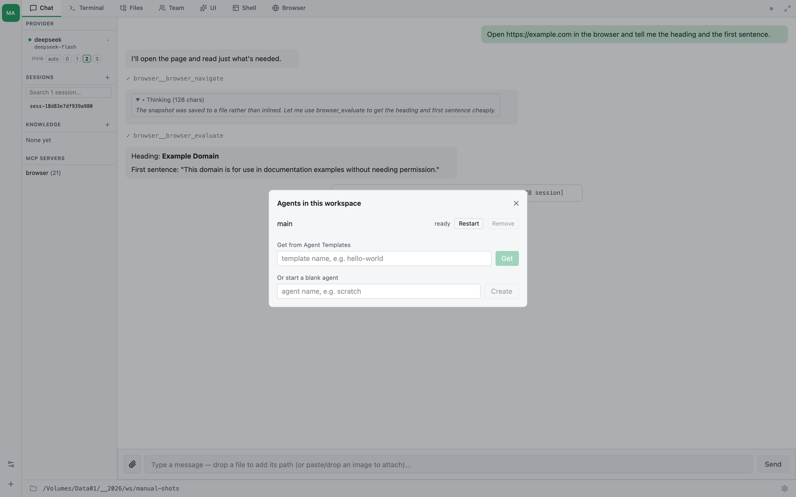

# บทที่ 35 — agent หลายตัวใน workspace เดียว

workspace หนึ่งอันเก็บ agent ได้หลายตัว ตัวหนึ่งทำวิจัย ตัวหนึ่งเขียน ตัวหนึ่ง
วิเคราะห์ — แต่ละตัวมีบทสนทนา ความจำ และการตั้งค่าของตัวเอง โดยทำงานบนไฟล์
โปรเจกต์ชุดเดียวกัน

> **คนละเรื่องกับ Agent Teams** [บทที่ 17](ch17-agent-teams.md) พูดถึงเพื่อนร่วมทีม
> ที่ *agent เรียกขึ้นมาเอง* ผ่าน `TeamCreate` แล้วประสานงานกันผ่านกล่องจดหมาย
> เพื่อกระจายงานชิ้นเดียวออกไป ส่วนบทนี้พูดถึง agent ที่ *คุณ* เอาเข้ามาไว้ใน
> workspace แล้วสลับใช้เอง ทั้งสองอย่างใช้พร้อมกันได้ — agent ตัวหนึ่งของคุณ
> จะไปตั้งทีมของมันเองก็ได้

## โมเดล

workspace คือโฟลเดอร์ที่มีโปรเจกต์ของคุณอยู่ ใต้ `.thclaws/` จะมี **ชั้นวาง**
ของ agent:

```
my-project/                  ← ไฟล์ของคุณ ทุก agent เห็นร่วมกัน
├── index.html
├── src/
└── .thclaws/
    ├── bots.json            ← workspace นี้มี agent อะไรบ้าง
    ├── settings.json        ← การตั้งค่าของตัว host เอง
    └── bots/
        ├── main/            ← agent ตัวหนึ่ง
        │   ├── AGENTS.md
        │   └── .thclaws/state/     ← เซสชัน KMS โปรไฟล์ browser ของมัน
        └── researcher/      ← อีกตัวหนึ่ง
            ├── AGENTS.md
            └── .thclaws/state/
```

การแบ่งแบบนี้ตั้งใจ: **ไฟล์ของคุณใช้ร่วมกัน ส่วนตัวตนของแต่ละ agent ไม่ใช่**

| ทุก agent ใช้ร่วมกัน | แยกของใครของมัน |
|---|---|
| ไฟล์ทุกไฟล์ในโปรเจกต์ — working directory ของ agent คือรากของ workspace | `AGENTS.md` และ `CLAUDE.md` — คำสั่งประจำตัว |
| git repository | `settings.json` — provider, model, โหมด permission, สวิตช์ฟีเจอร์ |
| | เซสชันและประวัติบทสนทนา |
| | knowledge base ([บทที่ 9](ch09-knowledge-bases-kms.md)) |
| | โปรไฟล์ browser รวมถึงการล็อกอินที่ค้างไว้ ([บทที่ 28](ch28-browser-automation.md)) |
| | `manifest.json` — Agent Template ที่มันมาจาก |

รุ่นก่อนหน้านี้เคยย้ายไฟล์โปรเจกต์เข้าไปในโฟลเดอร์ของ agent ด้วย แต่ถูกกลับ
มติไปแล้ว เพราะไฟล์ที่อยู่ใน `.thclaws/bots/main/` มองไม่เห็นจาก Finder และ
agent ตัวอื่นก็มองไม่เห็น ซึ่งตรงข้ามกับความหมายของการมี workspace ร่วมกัน
ตอนนี้พอเปิด workspace แบบนั้นขึ้นมา ไฟล์จะถูกย้ายกลับไปไว้ที่รากให้เอง

## แถบ agent



ทั้งในแอปเดสก์ท็อปและใน `--serve` แถบแคบ ๆ ที่ขอบซ้ายสุดคือรายชื่อ agent —
หนึ่งช่องต่อหนึ่งตัว มีอักษรย่อกำกับ และตัวที่ใช้อยู่จะถูกไฮไลต์ เอาเมาส์ชี้
ค้างไว้จะเห็นชื่อกับสถานะ (`main — ready`) คลิกเพื่อสลับ แล้วแถบแท็บ แถบข้าง
และบทสนทนาจะตามไปทั้งหมด

ด้านล่างของแถบมีปุ่มสองปุ่ม:

| ปุ่ม | ทำอะไร |
|---|---|
| **Workspace settings** | เพิ่ม ลบ หรือรีสตาร์ท agent |
| **Add an agent** | ดึงจาก Agent Template หรือเริ่มตัวเปล่า ๆ |

## การเพิ่ม agent

agent มาจาก **Agent Templates** — catalog ที่ thclaws.cloud ซึ่งอยู่ใน
[บทที่ 27](ch27-thclaws-cloud.md) เปิดดูได้ที่นั่นหรือด้วย `/cloud list`

จาก GUI: กด **+** ที่ท้ายแถบ แล้วเลือกเทมเพลต

จากเทอร์มินัล โดยอยู่ใน workspace:

```bash
thclaws bots add <template>              # เวอร์ชันล่าสุด
thclaws bots add <template> --version 3  # ปักหมุดเวอร์ชัน
```

เทมเพลตจะถูกแตกลงใน `.thclaws/bots/<slug>/` และขึ้นทะเบียนใน
`.thclaws/bots.json` ส่วน host ที่รันอยู่แล้วจะรับรู้ตอนเริ่มรอบถัดไป

การติดตั้งเป็นงานของ **host** ไม่ใช่สิ่งที่ agent ทำให้คุณได้ — เพราะ sandbox
ของ agent จบลงที่โฟลเดอร์ของตัวเอง มันจึงเขียนลงโฟลเดอร์ของเพื่อนไม่ได้ ส่วน
การสั่ง `/cloud get` *ข้างใน* agent ตัวหนึ่งจะเป็นการแทนที่ agent ตัวนั้น ซึ่ง
คือความหมายที่สมเหตุสมผลของคำว่า "get" เมื่อยืนอยู่ตรงนั้น

## การลบออก

```bash
thclaws bots remove <slug>           # ถอดออกจากทะเบียน โฟลเดอร์ยังอยู่บนดิสก์
thclaws bots remove <slug> --purge   # ลบโฟลเดอร์ทิ้งด้วย
```

ถ้าไม่ใส่ `--purge` จะไม่มีอะไรหาย เซสชัน knowledge base และการล็อกอินของ
browser ยังอยู่ที่เดิม และถ้าเพิ่ม agent ตัวเดิมกลับเข้ามาก็จะได้ของเดิมคืน

## มันรันยังไง

workspace ถูกเสิร์ฟโดย **host** ที่คอยดูแลหนึ่ง process ต่อหนึ่ง agent แต่ละ
agent คือ engine process ธรรมดาที่ตั้ง working directory ไว้ที่โฟลเดอร์ของ
ตัวเอง ซึ่งเป็นสิ่งที่ทำให้มันได้ตัวตน การตั้งค่า sandbox และโหมด permission
ที่ถูกต้อง โดยไม่มีอะไรรั่วข้ามไปหาเพื่อน

ตัว host เองไม่โหลด agent ไม่โหลดโมเดล และไม่โหลด MCP server ใด ๆ มันเป็นโค้ด
ล้วน ๆ ไม่ใช่สิ่งที่หน้าเว็บจะคุยด้วยได้ — ซึ่งเป็นประเด็นทั้งหมด: เพราะมัน
เข้าถึงโฟลเดอร์ของ agent ได้ทุกตัว มันจึงต้องไม่เป็น agent เสียเอง

ถ้า process ของ agent ตัวไหนตาย host จะสตาร์ตให้ใหม่

## ตรวจสอบและอัปเกรด workspace

```bash
thclaws bots status
```

```
workspace  /Volumes/Data01/projects/my-project
layout     multiple agents (v3 or later)
agent      main (Main)
```

workspace ที่สร้างไว้ก่อนจะมีระบบหลาย agent จะมี agent ตัวเดียวอยู่ที่ราก
พอเปิดในแอปเดสก์ท็อปหรือด้วย `--serve` มันจะอัปเกรดให้ในที่ ถ้าอยากทำเอง หรือ
อยากดูก่อนว่าอะไรจะย้ายไปไหนบ้าง:

```bash
thclaws bots migrate --dry-run
thclaws bots migrate
```

การ migrate ทำต่อจากที่ค้างได้ — ถ้าถูกขัดจังหวะ ก็สั่งใหม่ได้เลย ส่วนถ้าจะ
ย้อนกลับ สำหรับ workspace ที่มี agent ตัวเดียวชื่อ `main`:

```bash
thclaws bots unmigrate
```

## ข้อจำกัดและจุดที่ต้องระวัง

- **agent ใช้ไฟล์ร่วมกัน จึงเขียนทับกันได้** ไม่มีการล็อกไฟล์ระหว่าง agent
  การสั่ง agent สองตัวให้แก้ไฟล์เดียวกันพร้อมกันได้ผลแบบเดียวกับให้คนสองคนทำ
- **`.thclaws/settings.json` ที่ parse ไม่ผ่านจะทำให้ทุกสวิตช์อ่านได้เป็นปิด**
  โดยไม่มีคำเตือน และมีผลเฉพาะ agent ตัวนั้น ถ้าฟีเจอร์หนึ่งเปิดไม่ติดกับ
  agent ตัวหนึ่งแต่ตัวอื่นใช้ได้ ให้ตรวจก่อนว่าไฟล์ของตัวนั้นเป็น JSON ที่ถูกต้อง
- **โฟลเดอร์ของ agent คือ working directory ของมัน** ขณะที่ไฟล์ของคุณอยู่ที่
  รากของ workspace ซึ่งสูงขึ้นไปหนึ่งชั้น เครื่องมือที่รับพาธเต็มจะไม่กำกวม
  ส่วนพาธสัมพัทธ์เปล่า ๆ จะถูกตีความเทียบกับโฟลเดอร์ของ agent ฉะนั้นเวลาสำคัญ
  ให้ระบุให้ชัดว่าหมายถึงที่ไหน
